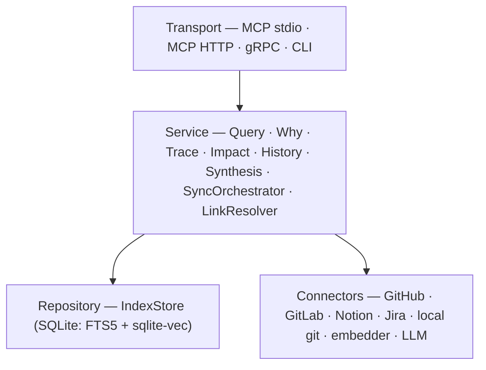

# Lore

**A decision-provenance engine for engineering teams.** Ask *why* a decision was
made — and what happened afterwards — and get back evidence where every claim
carries a source URL.

> ### 🚧 Work in progress
>
> Lore is under active development and has not been released. The retrieval core,
> provenance engine, GitHub/GitLab/Notion/Jira connectors, code anchoring, background
> sync, both MCP transports, the `lore.v1` gRPC API and LLM synthesis are implemented
> and covered by tests. See [Status](#status) for the exact line.

---

## The problem

Teams lose their *why*. Decisions happen in incident channels, Jira tickets, Notion
pages and PR reviews; then people rotate and six months later nobody can answer
*"why did we choose B over A when incident X happened?"* The answer exists — scattered
across a trail nobody reads manually. A commit that says only `PROJ-4521` carries no
reasoning: the reasoning is in the ticket, and the *consequences* are in a postmortem
written weeks later.

Codebase RAG tools answer **what** the code is. Lore answers **why it was decided and
what happened next**.

## How it works

1. **Ingest** — connectors stream documents from GitHub, GitLab, Notion and Jira into
   one normalized `Document` model. Every source is optional.
2. **Link** — a resolver turns raw references (ticket keys, URLs, commit SHAs, file
   paths) into a typed, directional **edge graph**: ticket → design doc → PR → review
   thread → commit.
3. **Answer** — one pipeline, four seed modes: `resolve anchor → seed → graph walk →
   hybrid retrieval → rank → EvidenceBundle`. Retrieval is BM25 (FTS5) + vector KNN
   (sqlite-vec) fused with Reciprocal Rank Fusion.

Two design choices set it apart:

- **Code is one anchor among several, not the center.** A Jira + Notion workspace with
  no repository at all is a first-class configuration; `git blame` anchoring is an
  optional enrichment.
- **Honesty is a feature.** Every answer reports its `gaps` — *"Rate limit the export
  endpoint (jira:ticket:PROJ-4521) stands alone; no linked discussion"* — instead of
  fabricating a chain. No URL means no evidence, so the node is not returned.

## Two personas, one engine

| Ask-only workspace (no repos) | Code-anchored workspace |
|---|---|
| Sources: Jira + Notion (± GitHub/GitLab issues and PRs) | Same, plus local clones registered |
| *"Why B over A during incident X?"* → `find_decision` | *"Why does `auth.go:40-55` exist?"* → `why` |
| *"What impact did decision A have?"* → `impact_of` | *"How did this file evolve?"* → `history_of` |
| Anchors: query, document, time window | Additional anchor: code span (blame) |

Nothing in the first column is degraded. `find_decision`, `trace` and `impact_of` run
the full walk — chains, gaps, time anchoring — on a workspace with zero repositories;
the second column is the first plus one extra anchor type. Walk through either one:
[ask-only demo](docs/demo-ask-only.md) · [code-anchored demo](docs/demo-why.md).

## Quickstart

**Requirements:** Go 1.25+, `git`, and an OpenAI API key for embeddings — or a local
Ollama daemon instead, with `embedder.provider: ollama`.
No cgo, no Docker, no database server — SQLite ships inside the binary as pure-Go WASM
([ncruces/go-sqlite3](https://github.com/ncruces/go-sqlite3) + sqlite-vec), so the index
is a single portable file and queries work offline after a sync.

```bash
go install github.com/setthasit/Lore/cmd/lore@latest   # or: git clone … && make bin

export OPENAI_API_KEY=...          # embeddings
export LORE_GITHUB_TOKEN=...       # fine-grained, read-only PAT

lore init                          # writes a commented lore.yaml scaffold
lore source add jira               # optional: grow the workspace interactively
lore sync                          # first run creates ~/.lore/<workspace>.db
lore status                        # index counts, cursor ages, sync lock
lore ask "why did we pick sqlite?" # prose answer; needs an llm: block
```

`lore init` writes credential **variable names**, never credentials, and scaffolds the
GitHub source; `lore source add notion|jira|gitlab` appends the rest interactively.
`lore --version` prints the build stamp plus the embedder identity of the workspace.

### What an answer looks like

`lore ask` answers in prose, citing the documents it used — it needs the `llm:` block
in `lore.yaml`:

```
SQLite carries the index because it ships everywhere and needs no server [1].
Postgres with pgvector was the alternative the storage design weighed [2].

**Sources**

1. Index on SQLite, not Postgres — https://github.com/acme/lore/pull/12
2. Storage design — https://notion.so/design/storage
```

`why`, `trace`, `impact` and `history` print the evidence itself as a timeline (shape
shown; the values are invented):

```
provenance of Storage design

anchor: Storage design
        https://notion.so/design/storage

2 documents

2025-03-10 Storage design
   notion page · 2025-03-10
   https://notion.so/design/storage
      postgres with pgvector was the alternative

2025-03-12 Index on SQLite, not Postgres
   github pr · dev@example.test · 2025-03-12 · follow_up
   https://github.com/acme/lore/pull/12
      sqlite ships everywhere and needs no server

chains:
  notion:page:design/storage → github:pr:acme/lore/pull/12

gaps:
  no follow-up evidence after 2025-03-12
```

Pass `--explain` to any of those four to get prose instead of the timeline, and `--raw`
to any query command to get the `EvidenceBundle` as JSON for scripting. `--raw` wins
when both are given.

### What to expect

Lore is only as good as the trail your team leaves. Where commits name their tickets
and PRs describe their reasoning, chains run four and five hops deep across sources.
Where they do not, the honest outcome is a short chain plus a `gaps` line — retrieval
still surfaces the unlinked discussion, but nothing invents the missing edge. A first
sync of a large workspace is the slow part (it embeds every chunk); after that, syncs
are incremental and queries are local.

## Running the services

Lore is a single binary; the subcommand picks the transport.

```bash
lore mcp                              # MCP over stdio, for a local agent harness
lore serve --http 127.0.0.1:8080      # MCP streamable HTTP at /mcp + lore.v1 gRPC + background sync
```

`serve` also runs the sync scheduler, so the index stays fresh while the endpoints are
up. gRPC listens on `127.0.0.1:9090` unless `--grpc` or `server.grpc_addr` says
otherwise, and `--mtls` makes it require a client certificate signed by
`server.mtls.client_ca`.

A bind address that is not *provably* loopback is refused unless `server.mtls.cert` and
`server.mtls.key` are configured — `:8080` and `localhost:8080` do not qualify, because
a bare port reaches every interface and a host name is not proof.

Register the stdio server with an MCP host (Claude Code, Cursor, …):

```json
{
  "mcpServers": {
    "lore": {
      "command": "/absolute/path/to/lore",
      "args": ["mcp", "--config", "/absolute/path/to/lore.yaml"]
    }
  }
}
```

Per-client paths, the streamable-HTTP variant and the troubleshooting table live in the
[MCP quickstart](docs/quickstart-mcp.md).

MCP tools return the structured `EvidenceBundle`, never prose: the host model is already
an LLM, so it synthesizes in its own context and can immediately call another tool. That
is why **no LLM key is needed for MCP usage** — only an embedding key.

| MCP tool | Answers |
|---|---|
| `find_decision` | "why B over A, around incident X?" — retrieval-seeded, works with zero repos |
| `why` | "why does `auth.go:40-55` look like this?" — blame-seeded |
| `trace` | everything linked to one commit / PR / ticket / page, in order |
| `impact_of` | what followed a decision, as a chronological timeline |
| `history_of` | how one file evolved, commit by commit |
| `sync_now` / `sync_status` | trigger a sync round; report cursors, counts and the lock |

## CLI surface

| Command | Purpose |
|---|---|
| `lore init` · `lore source add <notion\|jira\|gitlab>` | scaffold and grow `lore.yaml` |
| `lore sync [--source <name>] [--reembed]` | one sync round; checkpoints per batch, so an interrupted run resumes |
| `lore status` | index counts, per-source cursor ages, sync lock state |
| `lore ask <question>` | synthesized prose; `--around --source --repo --doc-type --since --until --raw` |
| `lore why <file>:<L1>-<L2>` | blame-anchored trail; `--repo --explain --raw` |
| `lore trace <ref>` | one document's neighborhood; `--direction in\|out\|both --explain --raw` |
| `lore impact <ref \| "query">` | consequences timeline; `--question --explain --raw` |
| `lore history <path>` | file timeline; `--limit --before` pagination; `--explain --raw` |
| `lore mcp` · `lore serve` | MCP stdio · MCP streamable HTTP + `lore.v1` gRPC + scheduler |

Every command takes `--config` (default `./lore.yaml`).

## Guides

| Guide | Contents |
|---|---|
| [MCP quickstart](docs/quickstart-mcp.md) | Claude Code / Cursor config for stdio and streamable HTTP, tool routing, troubleshooting |
| [Source setup](docs/sources.md) | least-privilege credentials for GitHub, GitLab, Notion and Jira |
| [Fully local](docs/fully-local.md) | Ollama for embeddings and synthesis; what leaves the machine in each mode |
| [Ask-only demo](docs/demo-ask-only.md) | seeded Jira + Notion workspace, zero repositories, two flagship questions |
| [Code-anchored demo](docs/demo-why.md) | `why` on a real OSS repository: commit → PR → issue |

## Architecture

Strict unidirectional layering, wired with [Uber FX](https://github.com/uber-go/fx).
Transports never touch the store or a connector — including the MCP path.



One SQLite file per workspace holds `documents`, `chunks`, `chunks_fts` (BM25),
`chunk_vectors` (sqlite-vec), `edges`, `pending_refs`, `cursors`, `sync_lock` and
`meta`. The index is **derived data**: sources are ground truth, so deleting it is safe
and the next sync rebuilds it.

Sync is crash-safe by construction: connectors yield `Batch{Docs, Cursor}`, and the
orchestrator commits the batch *then* persists that batch's cursor. A single-row lease
with a heartbeat and TTL takeover keeps a manual `lore sync`, the background scheduler
and a `lore serve` daemon from colliding — and a crashed run never wedges the scheduler.

The design documents in [`docs/v3/`](docs/v3/) are the source of truth:

| Doc | Contents |
|---|---|
| [01 — Overview](docs/v3/01-overview.md) | problem, concept, differentiators, goals / non-goals |
| [02 — Architecture](docs/v3/02-architecture.md) | layers, transports, request flows, key decisions |
| [03 — Data Model](docs/v3/03-data-model.md) | Document / Edge model, schema, chunking, hybrid retrieval |
| [04 — Connectors & Sync](docs/v3/04-connectors-and-sync.md) | connector contract, scheduler, lease, link resolver |
| [05 — Query Engine](docs/v3/05-query-engine.md) | pipeline, anchors, tool algorithms, EvidenceBundle |
| [06 — Interfaces & Config](docs/v3/06-interfaces-and-config.md) | MCP tools, CLI, gRPC API, `lore.yaml` reference |
| [07 — Roadmap & Risks](docs/v3/07-roadmap.md) | milestones, named risks, open questions |

## Status

| Area | State |
|---|---|
| Config loading, validation, FX wiring | ✅ implemented |
| SQLite IndexStore — FTS5 + sqlite-vec, RRF fusion in Go | ✅ implemented |
| GitHub, GitLab, Notion, Jira connectors + shared conformance suite | ✅ implemented |
| Link resolver, edge graph, `pending_refs` retry | ✅ implemented |
| `find_decision`, `trace`, `impact_of` + event resolution | ✅ implemented |
| Code anchoring — `why`, `history_of` via local-clone blame/log | ✅ implemented |
| Sync lease, background scheduler, `sync_now` / `sync_status` | ✅ implemented |
| MCP stdio + MCP streamable HTTP (`lore serve`) | ✅ implemented |
| Embedder providers | ✅ OpenAI and Ollama — Ollama also needs `embedder.dimensions`, the model's native width (`ollama show <model>` reports it); an unimplemented provider is refused at startup |
| gRPC API (`lore.v1`) + mTLS | ✅ implemented |
| LLM synthesis — `lore ask`, `--explain`, gRPC `synthesize` | ✅ implemented; needs the `llm:` block in `lore.yaml` |
| Ollama fully-local pipeline | ✅ implemented — set `embedder.provider: ollama` (with `dimensions`) and `llm.provider: ollama`; both default to `http://127.0.0.1:11434` and take no API key |
| Release binaries | ✅ `make build.matrix` cross-compiles linux/darwin/windows × amd64/arm64 with `CGO_ENABLED=0` |

The CLI synthesizes for `lore ask` and `--explain`; gRPC synthesizes unless a request
sets `synthesize: false`. MCP always returns the evidence bundle itself — the host model
is already an LLM. A workspace with no `llm:` block says so instead of guessing.

## Development

```bash
make build         # go build ./...
make bin           # stamped, static binary at bin/lore
make build.matrix  # cross-compile every released platform with CGO_ENABLED=0
make test          # go test ./...
make lint          # golangci-lint run    — errcheck, govet, staticcheck
make gen.mock      # go generate ./...    — gomock doubles under internal/mocks
```

Tests need no external service: connectors run against `httptest` fixture servers, the
store against a temp SQLite file, and the end-to-end suite drives the real MCP transports
over a live DI graph — an MCP client session over streamable HTTP on a real socket,
against fixture GitHub/Notion/Jira servers. It includes an **ask-only** workspace with
zero repositories, which asserts that code-anchored tools refuse with a precondition
error rather than degrading.

Contributions follow the branch → PR workflow in [`AGENTS.md`](AGENTS.md): no direct
commits to `main`, and `make build`/`test`/`lint` green before a PR is opened.

## Security posture

- **Read-only toward every source.** Lore never writes to GitHub, GitLab, Notion or Jira.
- **Secrets live in environment variables named by config.** They are never written to
  `lore.yaml`, the index, or logs; least-privilege tokens are the documented default.
- **Off-loopback serving requires TLS**, enforced at startup, with mTLS support.
- **Private data leaves the machine only toward the configured embedder and, once `llm:`
  is set, the configured LLM.** With `provider: ollama` on both, nothing leaves at all.
