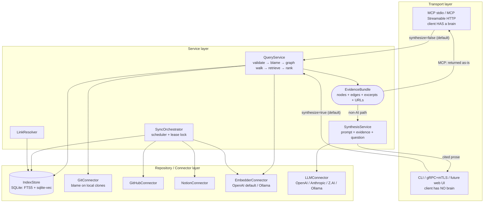
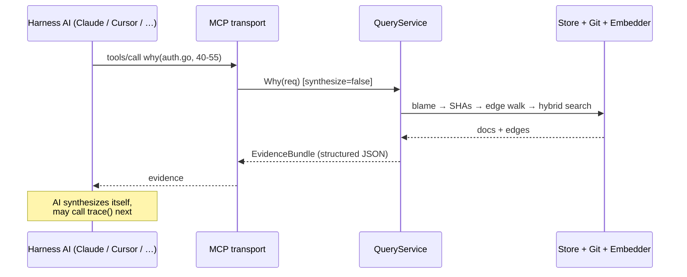
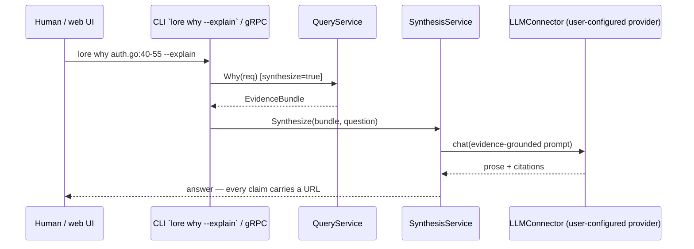

# 02 — Architecture

## Layering

Strict unidirectional dependency flow, wired with Uber FX:

```
Transport (MCP stdio / MCP Streamable HTTP / gRPC+mTLS / CLI)
    ↓ calls
Service (QueryService, SynthesisService, SyncOrchestrator, LinkResolver)
    ↓ calls
Repository (IndexStore) + Connectors (GitHub, Notion, Git, Embedder, LLM)
```

Rules (no exceptions):

- Transport calls **only** services. No transport ever touches the store or a
  connector directly — including the MCP path. The harness AI "drives the tool
  loop", but every tool call still goes through the service layer.
- Services orchestrate repositories and connectors; they carry all business
  logic and validation.
- The repository (IndexStore) talks only to SQLite. Connectors talk only to
  their external API. Neither contains business logic.

## Topology



Single binary; the subcommand selects the transport:

- `lore mcp` — MCP over stdio
- `lore serve` — MCP Streamable HTTP + gRPC (mTLS optional per listener)
- everything else — CLI

## Key design decisions

### D1 — MCP returns evidence, not prose

The MCP client already *is* an LLM. `QueryService` returns a structured
**EvidenceBundle** (nodes + edges + excerpts + URLs); the host model synthesizes
in its own context and may immediately call another tool (`trace`, `history_of`).

Consequences:

- The server needs **zero LLM API key** for MCP usage — only an embedding key
  for indexing/query embedding.
- No double-LLM cost, no token waste on pre-baked prose the host model would
  re-read anyway.

### D2 — One pipeline; synthesis is a toggle, not a fork

Both AI and non-AI surfaces share the identical pipeline:
`validate → blame → graph walk → hybrid retrieval → rank → EvidenceBundle`.
The only difference is the final optional step, controlled by a `synthesize`
flag on the request:

| Surface | Default | Override |
|---|---|---|
| MCP (stdio / Streamable HTTP) | `synthesize=false` | — (host model synthesizes) |
| CLI | `synthesize=true` for `lore ask` / `--explain`; raw pretty-print otherwise | `--raw` |
| gRPC | `synthesize=true` | `Why{synthesize: false}` for e.g. UI graph rendering |

Careful with the word "HTTP": MCP-over-Streamable-HTTP is on the **AI** side;
gRPC (and the future web UI) is on the **non-AI** side.

### D3 — gRPC is the programmatic API, not an MCP transport

The MCP spec defines stdio and Streamable HTTP only. gRPC (+mTLS) exists for
programmatic consumers — primarily the future web UI — and includes
server-streaming sync progress. See [06](06-interfaces-and-config.md).

### D4 — Single SQLite file per workspace

FTS5 (BM25) + sqlite-vec (vectors) + RRF fusion in Go. Zero external infra;
works offline after sync. See [03](03-data-model.md).

### D5 — Every connector is optional

A workspace declares its sources in `lore.yaml`. Absent source = not synced,
not required. Adding a new source (GitLab, Jira, Confluence, ClickUp) is one
package implementing the `Connector` interface plus an FX provider.

## Request flows

### AI path (MCP)



### Non-AI path (CLI / gRPC)



## Error handling

Central `internalerror`-style package: typed constructors
(`NewBadRequestError`, `NewNotFoundError`, `NewInternalError`, …).
Layer policy:

- Connectors/repository: return raw errors with context wrapping, no business
  classification.
- Services: classify into internal error types.
- Transports: map to protocol-native codes — MCP tool error results, gRPC
  status codes, CLI exit codes + stderr.

## Testing strategy

- **Services** — gomock for IndexStore + all connectors; table-driven tests for
  graph-walk and ranking logic (pure functions where possible).
- **Repository** — integration tests against a temp SQLite file (fast, no
  external infra; no `testing.Short()` gymnastics needed).
- **Connectors** — `httptest` servers replaying recorded GitHub/Notion
  fixtures; retry/pagination logic covered explicitly.
- **Transports** — mocked services; assert request parsing and error mapping.
- **End-to-end smoke** — a tiny fixture git repo + fixture API server; run
  `sync` then `why`, assert the citation chain.

## Project structure (planned)

```
cmd/lore/                   # single entry point, subcommands
internal/
├── transport/
│   ├── mcp/                # stdio + streamable HTTP (official Go MCP SDK)
│   ├── grpc/               # gRPC controllers, mTLS setup
│   └── cli/                # command implementations
├── services/               # QueryService, SynthesisService, SyncOrchestrator, LinkResolver
├── repositories/           # IndexStore (SQLite)
├── connectors/
│   ├── github/
│   ├── notion/
│   ├── gitrepo/            # local-clone blame/log
│   ├── embedder/           # provider interface + openai/, ollama/
│   └── llm/                # provider interface + openai/, anthropic/, zai/, ollama/
├── di/                     # Uber FX modules
├── entities/               # Document, Edge, EvidenceBundle, Cursor, …
├── errors/internalerror/
└── config/                 # lore.yaml loading + validation
api/proto/lore/v1/          # gRPC contract
docs/                       # these documents
```
