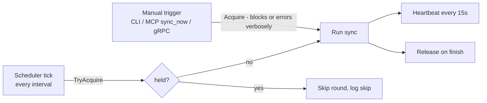

# 04 — Connectors & Sync

## Connector contract

One interface; every source is a package implementing it plus an FX provider:

```go
type Connector interface {
    Name() string // "github", "notion", …

    // Changes streams documents modified since cursor, newest-last,
    // and returns the next cursor. Must be resumable and idempotent.
    Changes(ctx context.Context, cursor Cursor) (iter.Seq2[Document, error], Cursor, error)
}
```

Contract rules:

- **Optional by construction.** `lore.yaml` declares which sources exist for a
  workspace; the SyncOrchestrator only iterates configured connectors. A
  Notion-only project or a GitHub-only project is fully supported.
- **No business logic.** Connectors fetch, paginate, retry, and normalize to
  `Document` + `RawRef`s. Ref *resolution* is the LinkResolver's job.
- **Read-only.** No connector ever writes to its source.
- Credentials come from environment variables named in config — never stored
  in `lore.yaml` or the index.

### GitHubConnector (v1)

- Auth: PAT (`LORE_GITHUB_TOKEN`); public and private repos.
- Ingests per configured repo: commits (message + metadata), PRs (body),
  PR reviews and review comments, issues and issue comments.
- GraphQL API for backfill (batches related objects, fewer round-trips under
  rate limits); cursor = per-repo `updated_at` watermarks.
- Emits `RawRef`s: ticket keys in commit/branch/PR text, URLs in bodies
  (Notion links!), `#123` issue/PR references, commit SHAs, file paths in
  diffs' touched-file lists.
- Explicit API relations (PR ↔ closing issue, PR ↔ commits) are emitted as
  ready-made high-confidence refs.

### NotionConnector (v1)

- Auth: integration token (`LORE_NOTION_TOKEN`); scope limited to configured
  `root_pages` subtrees.
- Ingests pages + their block content flattened to markdown-ish text.
- Cursor: Notion `last_edited_time` search watermark.
- Emits `RawRef`s: URLs to GitHub PRs/commits/issues, repo file paths
  mentioned in text, ticket keys.

### GitConnector (repository blame — not a `Connector`)

Separate small interface over **local clones** registered in the workspace:

```go
type GitRepo interface {
    Blame(ctx context.Context, path string, startLine, endLine int) ([]BlameSpan, error)
    Log(ctx context.Context, path string) ([]CommitRef, error)
}
```

Local git is the ground truth for `why`/`history_of` line attribution; the
GitHub/GitLab connectors *enrich* those commits with PR/review/issue layers.
Implementation: shell out to `git` (blame with `--porcelain`) — robust,
zero-dependency, already installed everywhere Lore runs.

### EmbedderConnector / LLMConnector

```go
type Embedder interface {
    Embed(ctx context.Context, texts []string) ([][]float32, error)
    Identity() string // "openai/text-embedding-3-small/1536" — stored in meta
}

type LLM interface { // used ONLY by SynthesisService (non-AI surfaces)
    Complete(ctx context.Context, system, user string) (string, error)
}
```

Both pluggable via config. Embedder default: OpenAI; Ollama for fully-local.
LLM providers: OpenAI, Anthropic, Z.AI, Ollama — user-configured, never
required for MCP usage.

### Future connectors (post-v1, same contract)

GitLab (proves the git-host abstraction; MR ≈ PR mapping), Jira (ticket-key
linking is the classic case), Confluence, ClickUp. Each is a new package +
config entry; core does not change.

## Sync

### Scheduler + manual trigger + lease lock

Requirements: background scheduler keeps the index fresh; user can trigger
manually; a manual run **locks** sync and the scheduler **skips its round**.

Mechanism — single-row lease in SQLite (`sync_lock`):



- Lease carries `holder`, `acquired_at`, `heartbeat_at`. A lease whose
  heartbeat is older than TTL (60s) is considered dead and may be taken over —
  a crashed sync never wedges the scheduler.
- Same lock covers scheduler-vs-scheduler (long round overlapping the next
  tick) and multiple processes sharing one workspace file (e.g. `lore serve`
  daemon + ad-hoc CLI).

### Sync round

For each configured connector:

1. Load cursor from `cursors`.
2. Stream `Changes`; upsert documents (idempotent by `DocID`).
3. Chunk changed documents; embed new/changed chunks (batched); update FTS +
   vectors.
4. Store emitted `RawRef`s.
5. Advance cursor **only after** the batch is durably committed
   (crash-safe resume).

Then run the LinkResolver pass.

### Link resolver

Second pass converting `RawRef`s into typed `edges`:

| RawRef | Resolution | Edge kind | Confidence |
|---|---|---|---|
| Explicit API relation | direct | `commit_in_pr`, `pr_closes_issue` | 1.0 |
| URL to a known document | exact URL match | `references_doc` | 1.0 |
| Commit SHA in text | prefix match against ingested commits | `mentions_commit` | 0.9 |
| Ticket key `PROJ-123` | key match against ingested issues/tickets | `references_doc` | 0.9 |
| File path in text | path match against workspace repos | `mentions_path` | 0.7 |

Unresolved refs stay in `pending_refs` and are retried each round — a Notion
page linked from a PR may be ingested *after* the PR; the edge appears once
both sides exist. Resolution is idempotent (`INSERT OR IGNORE` semantics).

### Rate limits & backfill

First sync of a large repo is the stress case. Mitigations: GraphQL batching,
cursor checkpoints every batch (interruptible/resumable), respect
`Retry-After`/secondary-limit headers with exponential backoff, per-connector
concurrency of 1 in v1 (simple, sufficient).
