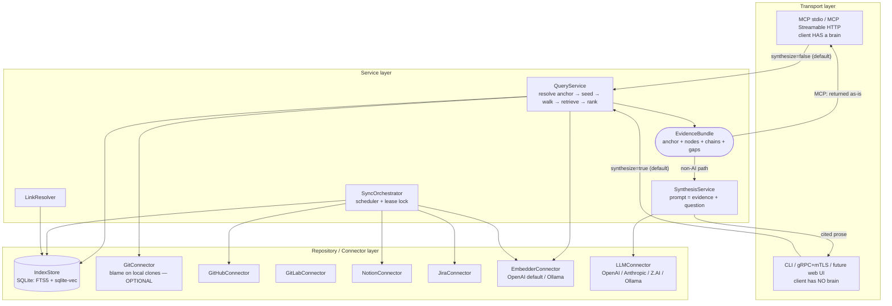
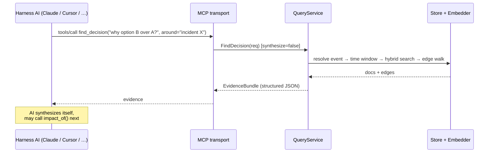
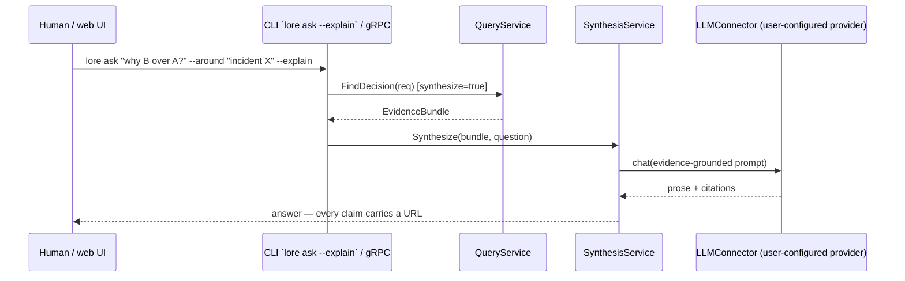

# 02 — Architecture

## Layering

Strict unidirectional dependency flow, wired with Uber FX:

```
Transport (MCP stdio / MCP Streamable HTTP / gRPC+mTLS / CLI)
    ↓ calls
Service (QueryService, SynthesisService, SyncOrchestrator, LinkResolver)
    ↓ calls
Repository (IndexStore) + Connectors (GitHub, GitLab, Notion, Jira, Git, Embedder, LLM)
```

Rules (no exceptions):

- Transport calls **only** services. No transport ever touches the store or a
  connector directly — including the MCP path. The harness AI "drives the tool
  loop", but every tool call still goes through the service layer.
- Services orchestrate repositories and connectors; they carry all business
  logic and validation.
- The repository (IndexStore) talks only to SQLite. Connectors talk only to
  their external API. Neither contains business logic.

## Topology



Single binary; the subcommand selects the transport:

- `lore mcp` — MCP over stdio
- `lore serve` — MCP Streamable HTTP + gRPC (mTLS optional per listener)
- everything else — CLI

## Key design decisions

### D1 — MCP returns evidence, not prose

The MCP client already *is* an LLM. `QueryService` returns a structured
**EvidenceBundle** (anchor + nodes + chains + gaps); the host model synthesizes
in its own context and may immediately call another tool (`trace`,
`impact_of`).

Consequences:

- The server needs **zero LLM API key** for MCP usage — only an embedding key
  for indexing/query embedding (or none, with Ollama).
- No double-LLM cost, no token waste on pre-baked prose the host model would
  re-read anyway.

### D2 — One pipeline; synthesis is a toggle, not a fork

Both AI and non-AI surfaces share the identical pipeline:
`resolve anchor → seed → graph walk → hybrid retrieval → rank → EvidenceBundle`.
The only difference is the final optional step, controlled by a `synthesize`
flag on the request:

| Surface | Default | Override |
|---|---|---|
| MCP (stdio / Streamable HTTP) | `synthesize=false` | — (host model synthesizes) |
| CLI | `synthesize=true` for `lore ask` / `--explain`; raw pretty-print otherwise | `--raw` |
| gRPC | `synthesize=true` | `FindDecision{synthesize: false}` for e.g. UI graph rendering |

Careful with the word "HTTP": MCP-over-Streamable-HTTP is on the **AI** side;
gRPC (and the future web UI) is on the **non-AI** side.

### D3 — One engine, four seed modes

Every query tool is the same pipeline with a different **seed**:

| Tool | Anchor | Seed documents |
|---|---|---|
| `find_decision` | free-text question (± time window from event resolution) | top-k hybrid-retrieval hits, lifted to parent documents |
| `why` | code span | blamed commits from the local clone |
| `trace` / `impact_of` | a specific document (ref) | the resolved document |
| `history_of` | file path | `git log --follow` commit sequence |

After seeding, the machinery is shared: graph walk (depth-capped,
confidence-pruned, direction-aware), semantic expansion, ranking, chain
assembly, gap reporting. **Every tool returns `Chains` and `Gaps`** — the
ask-only path gets the full engine, not a stripped-down retrieval endpoint.
Algorithms in [05](05-query-engine.md).

### D4 — Code is optional; anchors are a union

`repos:` in `lore.yaml` is optional. A workspace with zero repositories
supports `find_decision`, `trace`, `impact_of`, and sync tools fully; `why` and
`history_of` fail fast with a clear "no repositories registered — code
anchoring disabled" error. `EvidenceBundle.Anchor` is a typed union
(query / code span / document / time window), not a code-shaped struct.

### D5 — gRPC is the programmatic API, not an MCP transport

The MCP spec defines stdio and Streamable HTTP only. gRPC (+mTLS) exists for
programmatic consumers — primarily the future web UI — and includes
server-streaming sync progress. See [06](06-interfaces-and-config.md).

### D6 — Single SQLite file per workspace, pure-Go build

FTS5 (BM25) + sqlite-vec (vectors) + RRF fusion in Go. Zero external infra;
works offline after sync. Default driver: **ncruces/go-sqlite3 (WASM)** with
sqlite-vec embedded — no cgo, clean cross-compilation. The cgo variant
(mattn + sqlite-vec cgo bindings) stays available behind the same IndexStore
interface if benchmarks demand it. See [03](03-data-model.md).

### D7 — Every connector is optional

A workspace declares its sources in `lore.yaml`. Absent source = not synced,
not required. Adding a new source (GitLab, Confluence, ClickUp, Slack) is one
package implementing the `Connector` interface plus an FX provider.

### D8 — Connectors stream checkpointable batches

`Changes` yields `Batch{Docs, Cursor}` values; the orchestrator durably
commits a batch **then** persists that batch's cursor. Interrupted backfills
resume mid-source with no re-work and no duplicate writes (upserts are
idempotent by `DocID`). This replaces the v1 signature, which returned the
final cursor before the stream was consumed and made per-batch checkpointing
unimplementable. See [04](04-connectors-and-sync.md).

### D9 — The bundle is the contract; tools are disposable verbs

`EvidenceBundle` is the stability boundary: every surface (MCP, CLI, gRPC,
future web UI) consumes it, so its shape changes only additively. Tools are
thin verbs over it and stay cheap to add, rename, or retire. MCP deprecation
is in-place: the old tool stays registered with a "deprecated — use X"
description for one release, then disappears; host models follow the
description automatically.

### D10 — Plugin-ready seam, plugins deferred

The `Connector` contract is deliberately plugin-shaped — pure data in
(`Batch` of `Document` + `RawRef`), no business logic, no store access — but
v1 ships all connectors in-process (YAGNI: with three sources, packages beat
processes on every axis). Three disciplines keep the seam viable until a
plugin transport is warranted; see
[04 — Plugin readiness](04-connectors-and-sync.md#plugin-readiness-deferred).

## Request flows

### AI path (MCP) — ask-only workspace



### AI path (MCP) — code-anchored

Identical, except the tool is `why(repo, file, 40, 55)` and the seed step calls
the GitConnector for blame before walking.

### Non-AI path (CLI / gRPC)



## Error handling

Central `internalerror`-style package: typed constructors
(`NewBadRequestError`, `NewNotFoundError`, `NewPreconditionError`,
`NewInternalError`, …). Layer policy:

- Connectors/repository: return raw errors with context wrapping, no business
  classification.
- Services: classify into internal error types. Notable precondition errors:
  "no repositories registered" (`why`/`history_of` on ask-only workspace),
  "embedder identity mismatch — run `lore sync --reembed`".
- Transports: map to protocol-native codes — MCP tool error results, gRPC
  status codes, CLI exit codes + stderr.

## Testing strategy

- **Services** — gomock for IndexStore + all connectors; table-driven tests for
  graph-walk, event-resolution, impact-windowing, and ranking logic (pure
  functions where possible).
- **Repository** — integration tests against a temp SQLite file (fast, no
  external infra).
- **Connectors** — `httptest` servers replaying recorded GitHub/GitLab/Notion/Jira
  fixtures; retry/pagination/batch-checkpoint logic covered explicitly — plus
  the shared connector conformance suite
  ([04](04-connectors-and-sync.md#plugin-readiness-deferred)).
- **Transports** — mocked services; assert request parsing and error mapping.
- **End-to-end smoke, ask-only** — fixture Jira + Notion API servers, zero
  repos; run `sync` then `find_decision`/`impact_of`, assert the citation chain and the
  chronological impact timeline.
- **End-to-end smoke, code-anchored** — tiny fixture git repo + fixture API
  server; run `sync` then `why`, assert the blame-seeded chain.

## Project structure (planned)

```
cmd/lore/                   # single entry point, subcommands
internal/
├── transport/
│   ├── mcp/                # stdio + streamable HTTP (official Go MCP SDK)
│   ├── grpc/               # gRPC controllers, mTLS setup
│   └── cli/                # command implementations
├── services/               # QueryService, SynthesisService, SyncOrchestrator, LinkResolver
├── repositories/           # IndexStore (SQLite via ncruces/go-sqlite3)
├── connectors/
│   ├── github/
│   ├── notion/
│   ├── jira/
│   ├── gitrepo/            # local-clone blame/log (optional per workspace)
│   ├── embedder/           # provider interface + openai/, ollama/
│   └── llm/                # provider interface + openai/, anthropic/, zai/, ollama/
├── di/                     # Uber FX modules
├── entities/               # Document, Edge, Anchor, EvidenceBundle, Cursor, Batch, …
├── errors/internalerror/
└── config/                 # lore.yaml loading + validation
api/proto/lore/v1/          # gRPC contract
docs/                       # these documents
```
