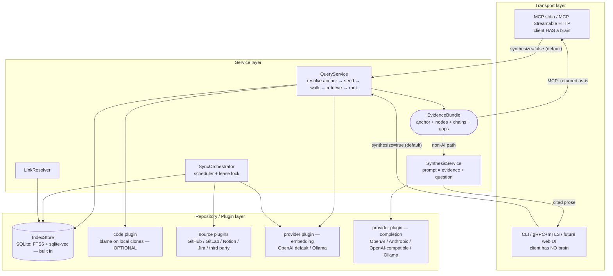
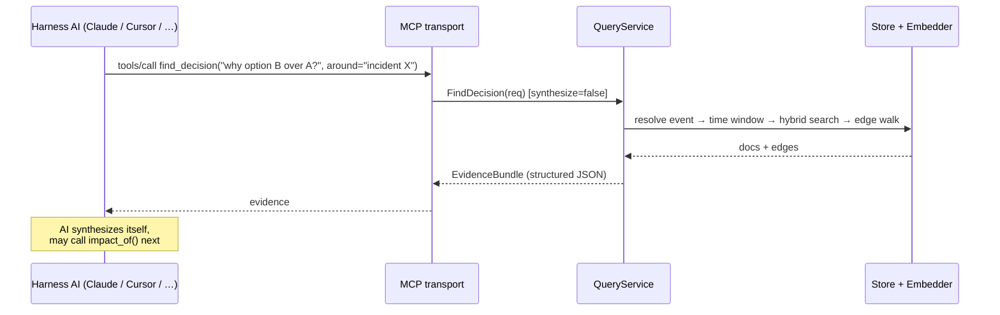
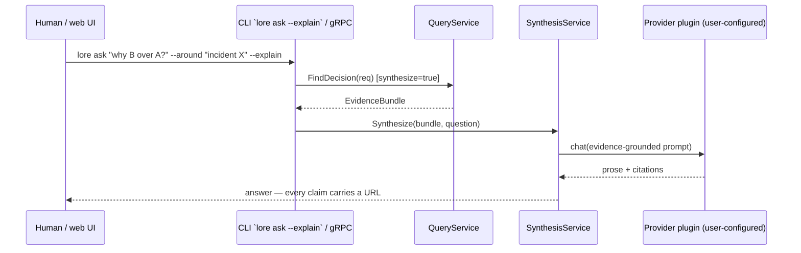

# 02 — Architecture

## Layering

Strict unidirectional dependency flow, wired with Uber FX:

```
Transport (MCP stdio / MCP Streamable HTTP / gRPC+mTLS / CLI)
    ↓ calls
Service (QueryService, SynthesisService, SyncOrchestrator, LinkResolver)
    ↓ calls
Repository (IndexStore) + Plugin registry (source / provider / code plugins)
```

Rules (no exceptions):

- Transport calls **only** services. No transport ever touches the store or a
  connector directly — including the MCP path. The harness AI "drives the tool
  loop", but every tool call still goes through the service layer. The two
  halves of that rule are backed differently. A transport importing anything
  under `plugins/` fails `make lint`: the depguard `engine` rule in
  `.golangci.yml` denies that module to every file under `internal/**`
  ([08](08-extensibility.md)). A transport importing
  `internal/repositories` is denied by no rule, and holds only because no
  non-test file under `internal/transport/` does. The `sdk` types a transport
  does import are the contract, not an implementation.
- Services orchestrate repositories and connectors; they carry all business
  logic and validation.
- The repository (IndexStore) talks only to SQLite. Plugins talk only to their
  external API or local clone. Neither contains business logic.
- Plugins never reach upward. A plugin receives its configuration, the secrets
  its manifest declared, and a `lore.Host` carrying one logger already tagged
  with the instance id (`sdk/host.go`, `Host`, and
  `internal/registry/build.go`, `Registry.Host`). It returns data and never
  touches the store, a service, or another plugin. `Host` offers no handle that
  would let it, and the import edge is lint-denied as well: the depguard `sdk`
  and `plugins` rules in `.golangci.yml` allow those trees only the standard
  library and `sdk` (plus `plugins` itself), so importing `internal/**` fails
  `make lint`. See [08](08-extensibility.md).

## Topology


```mermaid
flowchart TB
    subgraph T [Transport layer]
        MCP[MCP stdio / MCP Streamable HTTP<br/>client HAS a brain]
        NAI[CLI / gRPC+mTLS / future web UI<br/>client has NO brain]
    end
    subgraph S [Service layer]
        QS[QueryService<br/>resolve anchor → seed → walk → retrieve → rank]
        EB([EvidenceBundle<br/>anchor + nodes + chains + gaps])
        SY[SynthesisService<br/>prompt = evidence + question]
        SO[SyncOrchestrator<br/>scheduler + lease lock]
        LR[LinkResolver]
    end
    subgraph RC [Repository / Plugin layer]
        ST[(IndexStore<br/>SQLite: FTS5 + sqlite-vec — built in)]
        GIT[code plugin<br/>blame on local clones — OPTIONAL]
        SRC[source plugins<br/>GitHub / GitLab / Notion / Jira / third party]
        EMB[provider plugin — embedding<br/>OpenAI default / Ollama]
        LLM[provider plugin — completion<br/>OpenAI / Anthropic / OpenAI-compatible / Ollama]
    end
    MCP -->|"synthesize=false (default)"| QS
    NAI -->|"synthesize=true (default)"| QS
    QS --> ST & GIT & EMB
    QS --> EB
    EB -->|MCP: returned as-is| MCP
    EB -->|non-AI path| SY
    SY --> LLM
    SY -->|cited prose| NAI
    SO --> SRC & EMB & ST
    LR --> ST
```

Single binary; the subcommand selects the transport:

- `lore mcp` — MCP over stdio
- `lore serve` — MCP Streamable HTTP + gRPC (mTLS optional per listener)
- everything else — CLI

## Key design decisions

### D1 — MCP returns evidence, not prose

The MCP client already *is* an LLM. `QueryService` returns a structured
**EvidenceBundle** (anchor + nodes + chains + gaps); the host model synthesizes
in its own context and may immediately call another tool (`trace`,
`impact_of`).

Consequences:

- The server needs **zero LLM API key** for MCP usage — only an embedding key
  for indexing/query embedding (or none, with Ollama).
- No double-LLM cost, no token waste on pre-baked prose the host model would
  re-read anyway.

### D2 — One pipeline; synthesis is a toggle, not a fork

Both AI and non-AI surfaces share the identical pipeline:
`resolve anchor → seed → graph walk → hybrid retrieval → rank → EvidenceBundle`.
The only difference is the final optional step, controlled by a `synthesize`
flag on the request:

| Surface | Default | Override |
|---|---|---|
| MCP (stdio / Streamable HTTP) | `synthesize=false` | — (host model synthesizes) |
| CLI | `synthesize=true` for `lore ask` / `--explain`; raw pretty-print otherwise | `--raw` |
| gRPC | `synthesize=true` | `FindDecision{synthesize: false}` for e.g. UI graph rendering |

Careful with the word "HTTP": MCP-over-Streamable-HTTP is on the **AI** side;
gRPC (and the future web UI) is on the **non-AI** side.

### D3 — One engine, four seed modes

Every query tool is the same pipeline with a different **seed**:

| Tool | Anchor | Seed documents |
|---|---|---|
| `find_decision` | free-text question (± time window from event resolution) | top-k hybrid-retrieval hits, lifted to parent documents |
| `why` | code span | blamed commits from the local clone |
| `trace` / `impact_of` | a specific document (ref) | the resolved document |
| `history_of` | file path | `git log --follow` commit sequence |

After seeding, the graph walk (direction-aware, confidence-pruned), chain
assembly and gap reporting are shared by all five tools. Two things are not:
semantic expansion runs for `why` and `impact_of` only, and the time-prior
ranking formula runs for `find_decision` only. **Every query tool returns
`Chains` and `Gaps`**, so the ask-only path gets the full engine and not a
stripped-down retrieval endpoint. Which tool reaches which symbol is in
[05](05-query-engine.md).

### D4 — Code is optional; anchors are a union

`repos:` in `lore.yaml` is optional. A workspace with zero repositories
supports `find_decision`, `trace`, `impact_of`, and sync tools fully. `why` and
`history_of` fail fast with the precondition error `askOnlyRefusal`, whose text
is "no repositories registered — code anchoring disabled for this workspace"
(`internal/services/coderepo.go`). `EvidenceBundle.Anchor` is a typed union
(query / code span / document / time window), not a code-shaped struct.

### D5 — gRPC is the programmatic API, not an MCP transport

The MCP spec defines stdio and Streamable HTTP only. gRPC (+mTLS) exists for
programmatic consumers — primarily the future web UI — and includes
server-streaming sync progress. See [06](06-interfaces-and-config.md).

### D6 — Single SQLite file per workspace, pure-Go build

FTS5 (BM25) + sqlite-vec (vectors) + RRF fusion in Go. Zero external infra;
works offline after sync. The driver is **ncruces/go-sqlite3 (WASM)** with
sqlite-vec embedded — no cgo, clean cross-compilation. No cgo driver ships, and
a second store implementation would be one package behind the same `IndexStore`
interface. See [03](03-data-model.md).

### D7 — Every source is a plugin, and every plugin is optional

A workspace declares its sources in `lore.yaml`. Absent source = not synced,
not required. Adding a source (Confluence, ClickUp, Slack, an internal system)
is a plugin implementing `lore.Connector` plus a manifest — official plugins
live in `plugins/`, third-party plugins ship as their own binary. The engine
holds no source or provider name. See [08](08-extensibility.md).

### D8 — Connectors stream checkpointable batches

`Changes` yields `Batch{Docs, Cursor}` values, and the orchestrator commits a batch
**then** persists that batch's cursor (`internal/services/sync.go`,
`syncConnector`, whose `SetCursor` call follows `commitBatch`). Interrupted
backfills resume at the last checkpointed batch with no duplicate writes, since
upserts are idempotent by `DocID`. The replayed batch is re-done rather than
skipped, because a batch is several transactions and not one
([04](04-connectors-and-sync.md#sync-round)). This replaces the v1 signature,
which returned the final cursor before the stream was consumed and made
per-batch checkpointing unimplementable.

### D9 — The bundle is the contract; tools are disposable verbs

`EvidenceBundle` is the stability boundary: every surface (MCP, CLI, gRPC,
future web UI) consumes it, so its shape changes only additively. Tools are
thin verbs over it and stay cheap to add, rename, or retire. Both are review
rules for changes to this repository, not anything the code checks. The
deprecation convention is the same kind of rule: an MCP tool being retired stays
registered with a "deprecated, use X" description for one release and then
disappears, so host models follow the description. No tool is deprecated today.

### D10 — Connectors and providers are plugins; SQLite is not

Three plugin kinds — sources, model providers, code access — share one
registry, one manifest contract, and one configuration format. Compiled
plugins and out-of-process plugins ([09](09-plugin-protocol.md)) both surface
as the same interfaces, so the services layer never learns which mode a plugin
came from. The IndexStore stays built in: it has one implementation, and an
alternative would have to reproduce lease semantics and the fixed vector width
as well as hybrid search. The test for admitting a plugin kind, and the full
classification of every component against it, is in
[08](08-extensibility.md#what-is-a-plugin-and-what-is-not).

## Request flows

### AI path (MCP) — ask-only workspace


```mermaid
sequenceDiagram
    participant A as Harness AI (Claude / Cursor / …)
    participant M as MCP transport
    participant Q as QueryService
    participant R as Store + Embedder
    A->>M: tools/call find_decision("why option B over A?", around="incident X")
    M->>Q: FindDecision(req) [synthesize=false]
    Q->>R: resolve event → time window → hybrid search → edge walk
    R-->>Q: docs + edges
    Q-->>M: EvidenceBundle (structured JSON)
    M-->>A: evidence
    Note over A: AI synthesizes itself,<br/>may call impact_of() next
```

### AI path (MCP) — code-anchored

Identical, except the tool is `why(file, 40, 55)` and the seed step calls
the code plugin for blame before walking.

### Non-AI path (CLI / gRPC)


```mermaid
sequenceDiagram
    participant U as Human / web UI
    participant C as CLI `lore ask --explain` / gRPC
    participant Q as QueryService
    participant S as SynthesisService
    participant L as Provider plugin (user-configured)
    U->>C: lore ask "why B over A?" --around "incident X" --explain
    C->>Q: FindDecision(req) [synthesize=true]
    Q-->>C: EvidenceBundle
    C->>S: Synthesize(bundle, question)
    S->>L: chat(evidence-grounded prompt)
    L-->>S: prose + citations
    S-->>U: answer — every claim carries a URL
```

## Error handling

Central `internalerror`-style package: typed constructors
(`NewBadRequestError`, `NewNotFoundError`, `NewPreconditionError`,
`NewInternalError`, …). Layer policy:

- Connectors/repository: return raw errors with context wrapping, no business
  classification.
- Services: classify into internal error types. Notable precondition errors:
  "no repositories registered" (`why`/`history_of` on ask-only workspace),
  "embedder identity mismatch: … so run `lore sync --reembed`" and "chunk
  format mismatch: … so run `lore sync --reembed`" (a sync round, which is the
  only caller that runs either check).
- Transports: map to protocol-native codes. gRPC reads the kind off the
  internal error (`internal/transport/grpc/errors.go`, `rpcCodes`), MCP returns
  a tool error result (`internal/transport/mcp/server.go`, `toolError`), and the
  CLI returns the error from `RunE` for cobra to print on stderr with a
  non-zero exit.

## Testing strategy

- **Services** — gomock for IndexStore + all connectors; table-driven tests for
  graph-walk, event-resolution, impact-windowing, and ranking logic (pure
  functions where possible).
- **Repository** — integration tests against a temp SQLite file (fast, no
  external infra).
- **Plugins** — `httptest` servers replaying recorded GitHub/GitLab/Notion/Jira
  fixtures; retry/pagination/batch-checkpoint logic covered explicitly — plus
  `sdk/conform`, the shared conformance suite that every source plugin passes
  and that third parties run as certification
  ([08](08-extensibility.md#invariants-a-plugin-must-not-break)).
- **Registry** — registration validates the manifest and that the plugin
  implements what it declares (`internal/registry/registry.go`,
  `validateManifest`), and binding a provider role checks the built value for
  the capability (`internal/registry/build.go`, `assertCapability`), so a
  misdeclared plugin breaks the test suite rather than a user's sync.
- **Transports** — mocked services; assert request parsing and error mapping.
- **End-to-end smoke, ask-only** — fixture Jira + Notion API servers, zero
  repos; run `sync` then `find_decision`/`impact_of`, assert the citation chain and the
  chronological impact timeline.
- **End-to-end smoke, code-anchored** — tiny fixture git repo + fixture API
  server; run `sync` then `why`, assert the blame-seeded chain.

## Project structure

```
cmd/lore/                   # composition root: names the plugins this binary ships
app/                        # composable wiring (FX + cobra); takes []lore.Plugin
sdk/                        # package lore — public plugin contract, stdlib only
├── stdio/                  # Serve — the Go side of the plugin protocol
├── wire/                   # frame types and protocol constants
├── httpx/                  # retrying HTTP client
├── refs/                   # reference scanning helpers
└── conform/                # conformance / certification suite
plugins/                    # official plugins — same contract as third-party ones
├── sources/{github,gitlab,notion,jira}/
├── providers/{openai,anthropic,ollama,compat}/
└── code/git/               # local-clone blame/log
internal/
├── transport/
│   ├── mcp/                # stdio + streamable HTTP (official Go MCP SDK)
│   ├── grpc/               # gRPC controllers, mTLS setup
│   └── cli/                # command implementations
├── services/               # QueryService, SynthesisService, SyncOrchestrator, LinkResolver
├── repositories/           # IndexStore (SQLite via ncruces/go-sqlite3)
├── registry/               # plugin registration, manifest validation, instances
├── plugexec/               # out-of-process plugin host (see 09)
├── plugindist/             # fetch, verify and cache external plugin binaries (see 10)
├── plugbuild/              # `lore build` — a custom binary with plugins compiled in
├── di/                     # Uber FX modules
├── entities/               # Edge, Anchor, EvidenceBundle, IndexStats, SyncEvent, …
├── errors/internalerror/
├── fsx/                    # filesystem helpers shared across layers
├── urlx/                   # `Redact` strips userinfo and the query string, and the distribution and build paths call it before printing a URL
├── mocks/                  # gomock doubles, generated
├── config/                 # lore.yaml loading + validation
└── configschema/           # JSON Schema for lore.yaml, from the skeleton and plugin manifests
api/proto/lore/v1/          # gRPC contract
test/e2e/                   # composes the real binary, so it sits outside internal/
docs/                       # these documents
```
