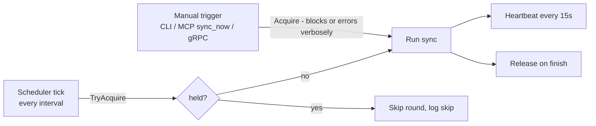

# 04 — Connectors & Sync

## Connector contract

One interface; every source is a package implementing it plus an FX provider:

```go
type Connector interface {
    Name() string // "github", "notion", "jira", …

    // Changes streams batches of documents modified since cursor,
    // oldest-first. Each Batch carries the cursor that becomes durable
    // once the batch is committed — the checkpoint unit IS the batch.
    // Must be resumable and idempotent.
    Changes(ctx context.Context, cursor Cursor) iter.Seq2[Batch, error]
}

type Batch struct {
    Docs   []Document
    Cursor Cursor // checkpoint to persist after Docs are durably committed
}
```

This signature exists so the orchestrator can implement crash-safe resume
honestly: *commit batch → persist batch.Cursor → next batch*. (A signature
returning one final cursor alongside the stream cannot checkpoint per batch.)

Contract rules:

- **Optional by construction.** `lore.yaml` declares which sources exist for a
  workspace; the SyncOrchestrator only iterates configured connectors.
  Jira-only, Notion-only, GitHub-only — all fully supported.
- **No business logic.** Connectors fetch, paginate, retry, and normalize to
  `Document` + `RawRef`s. Ref *resolution* is the LinkResolver's job.
- **Read-only.** No connector ever writes to its source.
- Credentials come from environment variables named in config — never stored
  in `lore.yaml` or the index.
- Both timestamps populated: `CreatedAt` (event time) and `UpdatedAt`
  (edit time / watermark). A source without true creation time sets
  `CreatedAt = UpdatedAt` and says so in its package doc.
- **Conformance-tested.** Every connector passes the shared contract suite —
  resumability, idempotency, batch-cursor honesty, timestamps — see
  [Plugin readiness](#plugin-readiness-deferred).

### GitHubConnector (v1)

- Auth: PAT (`LORE_GITHUB_TOKEN`); public and private repos.
- Ingest scope: `sources.github.repos` in config — **independent of local
  clones**; a workspace can index GitHub PRs/issues without any repository on
  disk.
- Ingests per configured repo: commits (message + metadata), PRs (body),
  PR reviews and review comments, issues and issue comments.
- GraphQL API for backfill (batches related objects, fewer round-trips under
  rate limits); cursor = per-repo `updated_at` watermarks.
- Emits `RawRef`s: ticket keys in commit/branch/PR text, URLs in bodies
  (Notion and Jira links!), `#123` issue/PR references, commit SHAs, file
  paths in diffs' touched-file lists.
- Explicit API relations (PR ↔ closing issue, PR ↔ commits) are emitted as
  ready-made high-confidence refs.

### NotionConnector (v1)

- Auth: integration token (`LORE_NOTION_TOKEN`); scope limited to configured
  `root_pages` subtrees.
- Ingests pages + their block content flattened to markdown-ish text.
- `CreatedAt` = Notion `created_time`; cursor: `last_edited_time` search
  watermark.
- Emits `RawRef`s: URLs to GitHub PRs/commits/issues and Jira tickets, repo
  file paths mentioned in text, ticket keys.

### JiraConnector (v1)

- Target: Jira **Cloud** (Data Center is post-v1; same package, second auth
  mode).
- Auth: email + API token (`LORE_JIRA_EMAIL`, `LORE_JIRA_TOKEN`), basic auth;
  `base_url` per site (`https://<org>.atlassian.net`).
- Endpoint: the **new** `/rest/api/3/search/jql` (the legacy `/rest/api/3/search`
  is deprecated) with `nextPageToken` pagination.
- Cursor: JQL watermark —
  `project IN (<configured>) AND updated >= "<watermark>" ORDER BY updated ASC`.
  Comment edits bump the issue's `updated`, so comment changes re-enter the
  stream automatically; re-ingest is idempotent by `DocID`.
- Ingests: issues → `ticket` (summary + description), comments →
  `ticket_comment`. Description/comments arrive as ADF (Atlassian Document
  Format) and are flattened to plain text, same approach as Notion blocks.
  `CreatedAt` = issue/comment `created`.
- Emits `RawRef`s: cross-ticket keys (`PROJ-456` in text), URLs (GitHub PRs,
  Notion pages), commit SHAs and file paths when present in text.
- This connector is what makes ticket-key refs from commits/PRs/Notion
  *resolve* — the classic provenance case ([link resolver](#link-resolver)).

### GitConnector (repository blame — not a `Connector`)

Separate small interface over **local clones** registered in the workspace.
Entirely optional: absent `repos:` config means this connector is never
constructed, and `why`/`history_of` return a precondition error.

```go
type GitRepo interface {
    Blame(ctx context.Context, path string, startLine, endLine int) ([]BlameSpan, error)
    Log(ctx context.Context, path string) ([]CommitRef, error)
}
```

Local git is the ground truth for `why`/`history_of` line attribution; the
GitHub/GitLab connectors *enrich* those commits with PR/review/issue layers
(matched via the `remote:` mapping in config). Implementation: shell out to
`git` (blame with `--porcelain`) — robust, zero-dependency, already installed
everywhere Lore runs.

### EmbedderConnector / LLMConnector

```go
type Embedder interface {
    Embed(ctx context.Context, texts []string) ([][]float32, error)
    Identity() string // "openai/text-embedding-3-small/1536" — stored in meta
}

type LLM interface { // used ONLY by SynthesisService (non-AI surfaces)
    Complete(ctx context.Context, system, user string) (string, error)
}
```

Both pluggable via config. Embedder default: OpenAI; Ollama for fully-local.
LLM providers: OpenAI, Anthropic, Z.AI, Ollama — user-configured, never
required for MCP usage.

### Future connectors (post-v1, same contract)

GitLab (proves the git-host abstraction; MR ≈ PR mapping), Confluence,
ClickUp, Slack (decision threads; `message` DocType). Each is a new package +
config entry; core does not change.

## Sync

### Scheduler + manual trigger + lease lock

Requirements: background scheduler keeps the index fresh; user can trigger
manually; a manual run **locks** sync and the scheduler **skips its round**.

Mechanism — single-row lease in SQLite (`sync_lock`):



- Lease carries `holder`, `acquired_at`, `heartbeat_at`. A lease whose
  heartbeat is older than TTL (60s) is considered dead and may be taken over —
  a crashed sync never wedges the scheduler.
- Same lock covers scheduler-vs-scheduler (long round overlapping the next
  tick) and multiple processes sharing one workspace file (e.g. `lore serve`
  daemon + ad-hoc CLI).

### Sync round

For each configured connector:

1. Load cursor from `cursors`.
2. Stream `Changes(cursor)`; for each `Batch`:
   a. Upsert documents (idempotent by `DocID`).
   b. Chunk changed documents; embed new/changed chunks (batched); update
      FTS + vectors.
   c. Store emitted `RawRef`s.
   d. Commit durably, **then** persist `batch.Cursor` — crash-safe resume at
      batch granularity.
3. After all connectors: run the LinkResolver pass.

### Link resolver

Second pass converting `RawRef`s into typed `edges`:

| RawRef | Resolution | Edge kind | Confidence |
|---|---|---|---|
| Explicit API relation | direct | `commit_in_pr`, `pr_closes_issue` | 1.0 |
| URL to a known document | exact URL match | `references_doc` | 1.0 |
| Commit SHA in text | prefix match against ingested commits | `mentions_commit` | 0.9 |
| Ticket key `PROJ-123` | key match against ingested tickets/issues | `references_doc` | 0.9 |
| "supersedes" / "replaced by" phrase + resolved ref in ADR-style text | pattern + ref resolution | `supersedes` | 0.8 |
| File path in text | path match against workspace repos | `mentions_path` | 0.7 |

Unresolved refs stay in `pending_refs` and are retried each round — a Notion
page linked from a PR may be ingested *after* the PR; the edge appears once
both sides exist. Resolution is idempotent, and an edge reached by two refs of
different confidence keeps the highest, so the stored graph does not depend on
which ref the resolver happened to reach first.

Edge direction convention: `Src` = the document whose body contains the
reference; `Dst` = the referenced document. The resolver never guesses
direction — it always knows which body the ref came from.

### Rate limits & backfill

First sync of a large source is the stress case. Mitigations: GraphQL batching
(GitHub), batch-level cursor checkpoints (interruptible/resumable everywhere),
respect `Retry-After`/secondary-limit headers with exponential backoff,
per-connector concurrency of 1 in v1 (simple, sufficient).

## Plugin readiness (deferred)

Connectors are the natural extension point for a future plugin ecosystem
(third-party Jira/Notion/… packages that never touch base code). v1 ships
every connector **in-process** — with three sources, packages beat processes
on type safety, testing, and distribution — but the seam is kept
plugin-viable by three disciplines:

1. **Entities-only dependency.** Connector packages import `entities` and the
   stdlib — never services, repositories, or each other.
2. **Schemas as if external.** `Document`, `RawRef`, `Batch`, `Cursor` are
   versioned and change additively only; they are the future wire format.
3. **Conformance suite.** One shared table of contract assertions —
   resumability, idempotency, batch-cursor honesty, both timestamps set,
   read-only behavior — runs against every built-in connector. It becomes the
   plugin certification suite verbatim.

When a plugin transport is warranted (>5 sources, or third-party authors),
candidates in order of preference: **exec + NDJSON batches over stdio** (any
language, no SDK needed), **subprocess gRPC** (hashicorp/go-plugin model,
proven by Terraform/Vault), **WASM via wazero** (the only option with a real
sandbox — an HTTP host-function with a domain allowlist). Go's native
`plugin` package is ruled out: version-locked, no Windows, breaks the pure-Go
build. Built-ins can later re-host through the chosen transport or stay
in-process behind the same interface; core changes either way are limited to
the FX provider list. The transport protocol is frozen only once the
connector contract stops moving — Δ10 in [00](00-design-deltas.md) shows why
freezing early turns internal fixes into ecosystem breaks.

Trust model to document before accepting third-party plugins: a connector
plugin holds its source token — "read-only" is a promise, not enforceable for
a subprocess. Mitigations when the time comes: per-plugin env allowlist (a
plugin sees only its own `token_env`), checksum-pinned plugin manifest, WASM
sandbox for untrusted authors.
