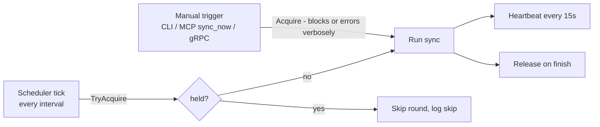

# 04 — Connectors & Sync

## Connector contract

One interface; every source is a **plugin** implementing it plus a manifest —
official plugins live in `plugins/sources/`, third-party plugins ship as their
own binary ([08](08-extensibility.md)):

```go
type Connector interface {
    Name() string // "github", "notion", "jira", …

    // Changes streams batches of documents modified since cursor,
    // oldest-first. Each Batch carries the cursor that becomes durable
    // once the batch is committed — the checkpoint unit IS the batch.
    // Must be resumable and idempotent.
    Changes(ctx context.Context, cursor Cursor) iter.Seq2[Batch, error]
}

type Batch struct {
    Docs   []Document
    Cursor Cursor // checkpoint to persist after Docs are durably committed
}
```

This signature exists so the orchestrator can implement crash-safe resume
honestly: *commit batch → persist batch.Cursor → next batch*. (A signature
returning one final cursor alongside the stream cannot checkpoint per batch.)

Contract rules:

- **Optional by construction.** `lore.yaml` declares which source instances
  exist for a workspace; the SyncOrchestrator only iterates configured
  instances. Jira-only, Notion-only, GitHub-only, GitLab-only — any subset is
  supported, and two instances of one plugin (two Jira sites) are as well.
- **Instance-scoped identity.** `Name()` is the instance id, which is also the
  cursor key, `Document.Source`, and the `DocID` prefix. The orchestrator
  rejects a batch whose documents disagree with the instance that produced
  them.
- **No business logic.** Connectors fetch, paginate, retry, and normalize to
  `Document` + `RawRef`s. Ref *resolution* is the LinkResolver's job.
- **Read-only.** No connector ever writes to its source.
- Credentials are named in config as environment variable names, resolved by
  the host, and injected. A connector never reads the environment, and sees
  only the secrets its manifest declared.
- Both timestamps populated: `CreatedAt` (event time) and `UpdatedAt`
  (edit time / watermark). A source without true creation time sets
  `CreatedAt = UpdatedAt` and says so in its manifest summary.
- **Conformance-tested.** Every connector passes `sdk/conform` — resumability,
  idempotency, batch-cursor honesty, timestamps, full identity — which is also
  the third-party certification suite ([08](08-extensibility.md)).

### GitHubConnector (v1)

- Auth: PAT (`LORE_GITHUB_TOKEN`); public and private repos.
- Ingest scope: `sources.github.repos` in config — **independent of local
  clones**; a workspace can index GitHub PRs/issues without any repository on
  disk.
- Ingests per configured repo: commits (message + metadata), PRs (body),
  PR reviews and review comments, issues and issue comments.
- GraphQL API for backfill (batches related objects, fewer round-trips under
  rate limits); cursor = per-repo `updated_at` watermarks.
- Emits `RawRef`s: ticket keys in commit/branch/PR text, URLs in bodies
  (Notion and Jira links!), `#123` issue/PR references, commit SHAs, file
  paths in diffs' touched-file lists.
- Explicit API relations (PR ↔ closing issue, PR ↔ commits) are emitted as
  ready-made high-confidence refs.

### GitLabConnector

- Auth: personal or project access token with `read_api` (`LORE_GITLAB_TOKEN`),
  sent as the `PRIVATE-TOKEN` header; `base_url` is optional and defaults to
  `https://gitlab.com`, so a self-managed instance only passes its root.
- Ingest scope: `sources.gitlab.projects`, namespaced paths
  (`group/project`, `group/subgroup/project`).
- Ingests per project: commits (message + changed paths from the commit diff),
  merge requests (description), discussion notes, issues and issue notes.
- REST v4 (`/api/v4/projects/<url-encoded path>/…`) with page pagination.
- **Merge requests reuse the existing document types.** An MR is a `pr`, its
  discussion threads are `pr_review` / `review_comment`, and the external key
  stays `<project>/pull/<iid>` so a `group/project#123` reference resolves the
  same way whatever the forge — while `URL` is GitLab's own
  `/-/merge_requests/<iid>`, because the citation must open the real page.
- Cursor: per project, an `updated_at` watermark sent back as `updated_after`
  (merge requests, issues) or `since` (commits), plus the last emitted document
  id. The watermark is inclusive, so the tiebreak drops the replayed unit —
  except for commits, whose committed date can long precede their push, and
  which therefore replay on a tie rather than risk being skipped.
- Emits `RawRef`s: file paths from commit diffs and note positions, commit SHAs
  (MR commits, merge and squash SHAs, prose), qualified `group/project#123`
  number references, plus ticket keys and URLs found in bodies and in source
  branch names.

### NotionConnector (v1)

- Auth: integration token (`LORE_NOTION_TOKEN`); scope limited to configured
  `root_pages` subtrees.
- Ingests pages + their block content flattened to markdown-ish text.
- `CreatedAt` = Notion `created_time`; cursor: `last_edited_time` search
  watermark.
- Emits `RawRef`s: URLs to GitHub PRs/commits/issues and Jira tickets, repo
  file paths mentioned in text, ticket keys.

### JiraConnector (v1)

- Target: Jira **Cloud** (Data Center is post-v1; same package, second auth
  mode).
- Auth: email + API token (`LORE_JIRA_EMAIL`, `LORE_JIRA_TOKEN`), basic auth;
  `base_url` per site (`https://<org>.atlassian.net`).
- Endpoint: the **new** `/rest/api/3/search/jql` (the legacy `/rest/api/3/search`
  is deprecated) with `nextPageToken` pagination.
- Cursor: JQL watermark —
  `project IN (<configured>) AND updated >= "<watermark>" ORDER BY updated ASC`.
  Comment edits bump the issue's `updated`, so comment changes re-enter the
  stream automatically; re-ingest is idempotent by `DocID`.
- Ingests: issues → `ticket` (summary + description), comments →
  `ticket_comment`. Description/comments arrive as ADF (Atlassian Document
  Format) and are flattened to plain text, same approach as Notion blocks.
  `CreatedAt` = issue/comment `created`.
- Emits `RawRef`s: cross-ticket keys (`PROJ-456` in text), URLs (GitHub PRs,
  Notion pages), commit SHAs and file paths when present in text.
- This connector is what makes ticket-key refs from commits/PRs/Notion
  *resolve* — the classic provenance case ([link resolver](#link-resolver)).

### Git (code plugin — not a `Connector`)

A separate plugin kind (`KindCode`) over **local clones** registered in the
workspace. Entirely optional: absent `repos:` config means no code plugin is
constructed, and `why`/`history_of` return a precondition error.

```go
type CodeRepo interface {
    Blame(ctx context.Context, path string, startLine, endLine int) ([]BlameSpan, error)
    Log(ctx context.Context, path string) ([]CommitRef, error)
}
```

Local git is the ground truth for `why`/`history_of` line attribution; the
GitHub/GitLab connectors *enrich* those commits with PR/review/issue layers
(matched via the `remote:` mapping in config). Implementation: shell out to
`git` (blame with `--porcelain`) — robust, zero-dependency, already installed
everywhere Lore runs.

### Model providers

Embedding and completion are one plugin kind (`KindProvider`) with two optional
capabilities:

```go
type Embedder interface {
    Embed(ctx context.Context, texts []string) ([][]float32, error)
    Dimensions() int
}

type Completer interface { // used ONLY by SynthesisService (non-AI surfaces)
    Complete(ctx context.Context, system, user string) (string, error)
}
```

`embedder:` and `llm:` in `lore.yaml` are role bindings naming a provider
instance and a model; binding a role to a provider lacking the capability is a
load-time error. The host — not the plugin — composes the vector-space
identity `<plugin>/<model>/<dims>` stored in `meta`, so no plugin can claim
another's identity. Embedder default: OpenAI; Ollama for fully-local. Vendors
speaking the OpenAI protocol (Z.AI, OpenRouter, Moonshot, DeepSeek, Groq, …)
are presets of one driver rather than packages. Synthesis is never required
for MCP usage. See [08](08-extensibility.md#provider-roles-and-drivers).

### Future sources (same contract)

Confluence, ClickUp, Slack (decision threads; `message` DocType). Each is a new
plugin plus a config entry; core does not change, and nothing requires the
plugin to live in this repository.

## Sync

### Scheduler + manual trigger + lease lock

Requirements: background scheduler keeps the index fresh; user can trigger
manually; a manual run **locks** sync and the scheduler **skips its round**.

Mechanism — single-row lease in SQLite (`sync_lock`):



- Lease carries `holder`, `acquired_at`, `heartbeat_at`. A lease whose
  heartbeat is older than TTL (60s) is considered dead and may be taken over —
  a crashed sync never wedges the scheduler.
- Same lock covers scheduler-vs-scheduler (long round overlapping the next
  tick) and multiple processes sharing one workspace file (e.g. `lore serve`
  daemon + ad-hoc CLI).

### Sync round

For each configured source instance:

1. Load cursor from `cursors`, keyed by instance id.
2. Stream `Changes(cursor)`; for each `Batch`:
   a. Upsert documents (idempotent by `DocID`), rejecting any document whose
      `Source` or `DocID` prefix disagrees with the instance.
   b. Chunk changed documents; embed new/changed chunks (batched); update
      FTS + vectors.
   c. Store emitted `RawRef`s, rejecting unknown `RefKind` values.
   d. Commit durably, **then** persist `batch.Cursor` — crash-safe resume at
      batch granularity.
3. After all instances: run the LinkResolver pass.

**Instances fail independently.** A failing instance ends its own stream at the
last committed cursor; the remaining instances still run, the LinkResolver pass
still runs over what was ingested, and the round reports partial failure with
the per-instance errors. One broken third-party plugin must not be able to
stop a workspace from syncing.

### Link resolver

Second pass converting `RawRef`s into typed `edges`:

| RawRef | Resolution | Edge kind | Confidence |
|---|---|---|---|
| Explicit API relation | direct | `commit_in_pr`, `pr_closes_issue` | 1.0 |
| URL to a known document | exact URL match | `references_doc` | 1.0 |
| Commit SHA in text | prefix match against ingested commits | `mentions_commit` | 0.9 |
| Ticket key `PROJ-123` | key match against ingested tickets/issues | `references_doc` | 0.9 |
| "supersedes" / "replaced by" phrase + resolved ref in ADR-style text | pattern + ref resolution | `supersedes` | 0.8 |
| File path in text | path match against workspace repos | `mentions_path` | 0.7 |

Unresolved refs stay in `pending_refs` and are retried each round — a Notion
page linked from a PR may be ingested *after* the PR; the edge appears once
both sides exist. Resolution is idempotent, and an edge reached by two refs of
different confidence keeps the highest, so the stored graph does not depend on
which ref the resolver happened to reach first.

Edge direction convention: `Src` = the document whose body contains the
reference; `Dst` = the referenced document. The resolver never guesses
direction — it always knows which body the ref came from.

### Rate limits & backfill

First sync of a large source is the stress case. Mitigations: GraphQL batching
(GitHub), batch-level cursor checkpoints (interruptible/resumable everywhere),
respect `Retry-After`/secondary-limit headers with exponential backoff,
per-connector concurrency of 1 in v1 (simple, sufficient).

## Plugins

Connectors, model providers and code access are plugins; the contract,
registry, manifest and configuration format are in
[08](08-extensibility.md). Two loading modes exist and both surface as the
same interfaces to the orchestrator:

- **Compiled** — registered in a binary's composition root. Official plugins
  are compiled into `lore`; a third party either upstreams a plugin or builds
  its own binary, because Go cannot load code dynamically.
- **External** — a separate process speaking NDJSON over stdio
  ([09](09-plugin-protocol.md)), declared in `plugins:` and fetched by
  coordinate ([10](10-plugin-distribution.md)). Any language, no rebuild.

Sync is I/O bound — a Jira backfill is HTTP round-trips — so the subprocess
boundary costs nothing measurable against the network, which is why external
is the default answer for third-party sources.

Trust: an external plugin runs with the user's privileges and holds its
source's token, so "read-only" is a promise, not an enforcement. The
mitigations that exist — per-plugin secret injection, mandatory digest
pinning, explicit installation, `lore plugin verify` — and the WASM sandbox
that would enforce it are in [10](10-plugin-distribution.md#trust-model).
