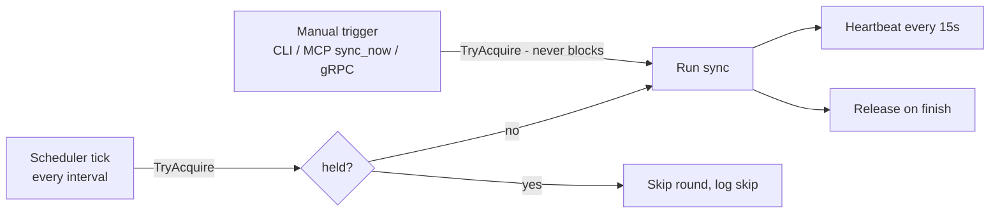

# 04 — Connectors & Sync

## Connector contract

One interface; every source is a **plugin** implementing it plus a manifest —
official plugins live in `plugins/sources/`, third-party plugins ship as their
own binary ([08](08-extensibility.md)):

```go
type Connector interface {
    Name() string // "github", "notion", "jira", …

    // Batches carry documents modified since cursor, oldest-first; a nil
    // cursor streams everything. Must be resumable and idempotent. An error
    // ends the stream: its batch is not committed and the cursor stays where
    // the last committed batch left it.
    Changes(ctx context.Context, cursor Cursor) iter.Seq2[Batch, error]
}

type Batch struct {
    Docs   []Document
    Cursor Cursor // checkpoint to persist after Docs are durably committed
}
```

This signature exists so the orchestrator can implement crash-safe resume
honestly: *commit batch → persist batch.Cursor → next batch*. (A signature
returning one final cursor alongside the stream cannot checkpoint per batch.)

Contract rules:

- **Optional by construction.** `lore.yaml` declares which source instances
  exist for a workspace; the SyncOrchestrator only iterates configured
  instances. Jira-only, Notion-only, GitHub-only, GitLab-only — any subset is
  supported, and two instances of one plugin (two Jira sites) are as well.
- **Instance-scoped identity.** `Name()` is the instance id, which is also the
  cursor key, `Document.Source`, and the `DocID` prefix. The registry refuses a
  connector that renames itself at construction
  (`internal/registry/build.go`), and the orchestrator rejects a batch whose
  documents disagree with the instance that produced them
  (`internal/services/sync.go`, `assertInstanceIdentity`, called from
  `commitBatch` before the upsert).
- **No business logic.** Connectors fetch, paginate, retry, and normalize to
  `Document` + `RawRef`s. Ref *resolution* is the LinkResolver's job.
- **Read-only by contract, not by enforcement.** `Connector` exposes no write
  method and `CodeRepo` none either, so nothing in the engine can ask a source
  to change. What a plugin's own HTTP client does is its own business: the four
  official source plugins call read endpoints only (the sole `POST`s are
  Notion's `/v1/search` and GitHub's GraphQL query endpoint), and for a
  third-party plugin read-only is a promise. The trust paragraph under
  [Plugins](#plugins) says what backs it.
- Credentials sit in the instance's `with:` block under each secret's own key,
  as a literal or as `${env:VAR}`, and the host resolves and injects them
  ([06](06-interfaces-and-config.md#security-posture)). A connector receives
  only the secrets its manifest declared. For an external connector the host
  also withholds its own environment, handing the subprocess an empty one and,
  on Windows, the variables the loader and runtime need
  (`internal/plugexec/env.go`, `minimalEnv`). A connector compiled into this
  binary shares the host process, so there not reading the environment is a
  rule the connector keeps.
- Both timestamps populated: `CreatedAt` (event time) and `UpdatedAt`
  (edit time / watermark). A source without true creation time sets
  `CreatedAt = UpdatedAt` and says so in its manifest summary.
- **An error ends the stream.** A connector that yields an error yields nothing
  after it, and nothing beside it: the batch in that yield is dropped with the
  error, so documents or a cursor riding there are lost rather than committed.
  The orchestrator stops at the first error and leaves the cursor where the
  last committed batch left it (`internal/services/sync.go`, `syncConnector`).
- **Conformance-tested.** Every source plugin runs `sdk/conform` from its own
  test (`plugins/sources/{github,gitlab,notion,jira}/connector_test.go`), which
  checks batch-cursor honesty, timestamps, full identity, idempotency,
  resumability, a stream that reaches its end, and an error that ends the stream
  (`sdk/conform/conform.go`, `Run`). The same suite is the third-party
  certification suite ([08](08-extensibility.md)).

### GitHubConnector (v1)

- Auth: PAT in `with.token`, falling back to `LORE_GITHUB_TOKEN` when the
  field is absent; public and private repos.
- Ingest scope: the instance's own `with.repos`, a required string list
  (`plugins/sources/github/plugin.go`, `Manifest`). It is independent of local
  clones, so a workspace can index GitHub PRs and issues with no repository on
  disk.
- Ingests per configured repo: commits (message + metadata), PRs (body),
  PR reviews and review comments, issues and issue comments.
- GraphQL API for backfill (batches related objects, fewer round-trips under
  rate limits); cursor = per-repo `updated_at` watermarks.
- Emits `RawRef`s: ticket keys in commit/branch/PR text, URLs in bodies
  (Notion and Jira links!), `#123` issue/PR references, commit SHAs, file
  paths in diffs' touched-file lists.
- Explicit API relations (PR ↔ closing issue, PR ↔ commits) are emitted as
  ready-made high-confidence refs.

### GitLabConnector

- Auth: personal or project access token with `read_api` in `with.token`
  (fallback `LORE_GITLAB_TOKEN`), sent as the `PRIVATE-TOKEN` header;
  `base_url` is optional and defaults to `https://gitlab.com`, so a
  self-managed instance only passes its root.
- Ingest scope: the instance's own `with.projects`, a required list of
  namespaced paths such as `group/project` or `group/subgroup/project`
  (`plugins/sources/gitlab/plugin.go`, `Manifest`).
- Ingests per project: commits (message + changed paths from the commit diff),
  merge requests (description), discussion notes, issues and issue notes.
- REST v4 (`/api/v4/projects/<url-encoded path>/…`) with page pagination.
- **Merge requests reuse the existing document types.** An MR is a `pr`, its
  discussion threads are `pr_review` / `review_comment`, and the external key
  stays `<project>/pull/<iid>` so a `group/project#123` reference resolves the
  same way whatever the forge — while `URL` is GitLab's own
  `/-/merge_requests/<iid>`, because the citation must open the real page.
- Cursor: per project, an `updated_at` watermark sent back as `updated_after`
  (merge requests, issues) or `since` (commits), plus the last emitted document
  id. The watermark is inclusive, so the tiebreak drops the replayed unit —
  except for commits, whose committed date can long precede their push, and
  which therefore replay on a tie rather than risk being skipped.
- Emits `RawRef`s: file paths from commit diffs and note positions, commit SHAs
  (MR commits, merge and squash SHAs, prose), qualified `group/project#123`
  number references, plus ticket keys and URLs found in bodies and in source
  branch names.

### NotionConnector (v1)

- Auth: integration token in `with.token` (fallback `LORE_NOTION_TOKEN`).
  `with.root_pages` scopes the sync to the named pages and their descendants,
  and an empty list syncs every page shared with the integration
  (`plugins/sources/notion/plugin.go`, `Manifest`).
- Ingests pages + their block content flattened to markdown-ish text.
- `CreatedAt` = Notion `created_time`; cursor: `last_edited_time` search
  watermark.
- Emits `RawRef`s: URLs to GitHub PRs/commits/issues and Jira tickets, repo
  file paths mentioned in text, ticket keys.

### JiraConnector (v1)

- Target: Jira **Cloud** (Data Center is post-v1; same package, second auth
  mode).
- Auth: email + API token in `with.email` and `with.token` (fallbacks
  `LORE_JIRA_EMAIL`, `LORE_JIRA_TOKEN`), basic auth; `base_url` per site
  (`https://<org>.atlassian.net`).
- Endpoint: the **new** `/rest/api/3/search/jql` (the legacy `/rest/api/3/search`
  is deprecated) with `nextPageToken` pagination.
- Cursor: a JQL watermark built by `Connector.jql`
  (`plugins/sources/jira/connector.go`). It always orders by `updated ASC`, it
  adds `project IN (<configured>)` only when the instance names projects, and
  it spells a resumed watermark as `updated >= "<watermark less jqlSlack>"` at
  minute granularity. The day of `jqlSlack` covers the zone-free literal Jira
  compares against. Comment edits bump the issue's `updated`, so comment
  changes re-enter the stream automatically, and re-ingest is idempotent by
  `DocID`.
- Ingests: issues → `ticket` (summary + description), comments →
  `ticket_comment`. Description/comments arrive as ADF (Atlassian Document
  Format) and are flattened to plain text, same approach as Notion blocks.
  `CreatedAt` = issue/comment `created`.
- Emits `RawRef`s: cross-ticket keys (`PROJ-456` in text), URLs (GitHub PRs,
  Notion pages), commit SHAs and file paths when present in text.
- This connector is what makes ticket-key refs from commits/PRs/Notion
  *resolve* — the classic provenance case ([link resolver](#link-resolver)).

### Git (code plugin — not a `Connector`)

A separate plugin kind (`KindCode`) over **local clones** registered in the
workspace. Entirely optional: absent `repos:` config means no code plugin is
constructed, and `why`/`history_of` refuse on their first statement, before
they touch the store. The refusal is `askOnlyRefusal`, raised by
`whyService.Why` (`internal/services/why.go`) and `historyService.HistoryOf`
(`internal/services/history.go`).

```go
type CodeRepo interface {
    Blame(ctx context.Context, path string, startLine, endLine int) ([]BlameSpan, error)
    Log(ctx context.Context, path string) ([]CommitRef, error)
    HasFileAtHEAD(ctx context.Context, path string) (bool, error)
}
```

Local git is the ground truth for `why`/`history_of` line attribution; the
GitHub/GitLab connectors *enrich* those commits with PR/review/issue layers
(matched via the `remote:` mapping in config). Implementation: shell out to
`git`, using `blame --porcelain` and `log --follow`
(`plugins/code/git/blame.go`, `plugins/code/git/log.go`). Robust,
zero-dependency, already installed everywhere Lore runs.

### Model providers

Embedding and completion are one plugin kind (`KindProvider`) with two optional
capabilities:

```go
type Embedder interface {
    Embed(ctx context.Context, texts []string) ([][]float32, error)
    Dimensions() int
}

type Completer interface { // used ONLY by SynthesisService (non-AI surfaces)
    Complete(ctx context.Context, system, user string) (string, error)
}
```

`embedder:` and `llm:` in `lore.yaml` are role bindings naming a provider
instance and a model. Binding a role to a provider lacking the capability fails
while the container is being built, before any transport serves
(`internal/registry/build.go`, `assertCapability`). The host composes the
vector-space identity `<plugin>/<model>/<dims>` stored in `meta`, not the
plugin: it is built from the plugin name, the configured model and the built
embedder's own `Dimensions()` (`internal/di/modules.go` and
`internal/services/vectorspace.go`, `NewVectorSpace`), so no plugin can claim
another's identity. Embedder default: OpenAI, with Ollama for fully-local.
Vendors speaking the OpenAI protocol (Z.AI, OpenRouter, Moonshot, DeepSeek,
Groq, …) are presets of one driver rather than packages. Synthesis is never
required for MCP usage. See [08](08-extensibility.md#provider-roles-and-drivers).

### Future sources (same contract)

Confluence, ClickUp, Slack (decision threads; `message` DocType). Each is a new
plugin plus a config entry; core does not change, and nothing requires the
plugin to live in this repository.

## Sync

### Scheduler + manual trigger + lease lock

Requirements: background scheduler keeps the index fresh; user can trigger
manually; a manual run **locks** sync and the scheduler **skips its round**.

Mechanism — single-row lease in SQLite (`sync_lock`):


```mermaid
flowchart LR
    MT[Manual trigger<br/>CLI / MCP sync_now / gRPC] -->|TryAcquire - never blocks| RUN[Run sync]
    SCH[Scheduler tick<br/>every interval] -->|TryAcquire| HELD{held?}
    HELD -->|yes| SKIP[Skip round, log skip]
    HELD -->|no| RUN
    RUN --> HB[Heartbeat every 15s]
    RUN --> REL[Release on finish]
```

- Lease carries `holder`, `acquired_at`, `heartbeat_at`, and is taken by one
  conditional `INSERT … ON CONFLICT` so two processes cannot both win
  (`internal/repositories/sqlite/sync.go`, `acquireLeaseSQL`,
  `Store.TryAcquireLease`). A lease whose heartbeat is older than
  `repositories.LeaseTTL` (60s) may be taken over, so a crashed sync never
  wedges the scheduler.
- **Nothing waits for the lease.** `TryAcquireLease` never blocks, so a manual
  run that finds the lease held fails immediately with a precondition error
  naming the holder and the TTL (`internal/services/sync.go`,
  `syncOrchestrator.Sync`, `leaseHeldError`). The scheduler treats the same
  refusal as a skip and logs it (`internal/services/scheduler.go`,
  `Scheduler.round`, matching `ErrSyncLocked`).
- The holder heartbeats every 15s while the round runs (`heartbeatInterval`,
  `heartbeatLease`). A heartbeat the store rejects because another process took
  the lease cancels the round rather than letting it keep writing.
- Same lock covers scheduler-vs-scheduler (long round overlapping the next
  tick) and multiple processes sharing one workspace file (e.g. `lore serve`
  daemon + ad-hoc CLI).

### Sync round

Once per round, before any instance is touched, `runRound` runs two
compatibility checks against `meta` (`internal/services/sync.go`). First,
`reconcileIdentity` compares the configured vector-space identity with the one
`meta` records. A first sync adopts it. A match proceeds. A mismatch refuses the
whole round with the `lore sync --reembed` remedy. `--reembed` rewinds every
cursor and wipes the chunk layer instead of comparing (`reembed`).

Second, `reconcileChunkFormat` compares the chunk format `meta` records with
`chunkFormat` (`internal/services/chunker.go`), the version of the text the
chunker writes. A match proceeds. An index with no format recorded adopts the
current one only while it holds no chunks. Any other value, or no value on an
index that holds chunks, refuses the whole round with the same
`lore sync --reembed` remedy. `reembed` records the current format after it
wipes the chunk layer, so a `--reembed` round passes this check.

A refused round reaches no connector. Queries run neither check, so an index
that sync refuses keeps answering from the chunks it already holds.
These two checks are the only places the embedder identity or the chunk format
can refuse work. `lore --version` also shows both embedder identities and flags
a mismatch (`internal/services/status.go`, `statusService.EmbedderIdentity`).
It refuses nothing. It does not read the chunk format.

Then, for each configured source instance:

1. Load cursor from `cursors`, keyed by instance id (`syncConnector`).
2. Stream `Changes(cursor)` and, for each `Batch` (`commitBatch`):
   a. Reject the batch whole if any document's `Source` or `DocID` prefix
      disagrees with the instance (`assertInstanceIdentity`) or carries an
      unknown `RefKind` (`assertDocumentRefKinds`). Both run before anything is
      written.
   b. Upsert documents, idempotent by `DocID` (`UpsertDocuments`).
   c. Chunk each document, embed its chunks in one call, and replace its chunk,
      FTS and vector rows (`indexDocument`, `ReplaceChunks`). A document that
      chunks to nothing still calls `ReplaceChunks`, so a shortened edit cannot
      leave the old chunks retrievable.
   d. Hand the batch to the LinkResolver, which stores unresolved `RawRef`s in
      `pending_refs` and writes the edges it can resolve now (`LinkResolver.Link`).
   e. **Then** persist `batch.Cursor` (`SetCursor`).
3. After all instances: run the LinkResolver pass over `pending_refs`
   (`LinkPending`).

The cursor is the only durability boundary. A batch is not one transaction,
because step 2b, each document in 2c, and 2d are separate ones. A crash inside
a batch can therefore leave documents stored with no chunks for the ones it had
not reached. The cursor still points at the previous batch, so the next round
replays the whole batch and the upserts overwrite what survived. Nothing is
lost, and a reader should not expect a half-finished batch to be invisible in
the meantime: a query between the crash and the next round can retrieve a
document whose chunks are stale.

**Instances fail independently.** A failing instance ends its own stream at the
last committed cursor, the remaining instances still run, the LinkResolver pass
still runs over what was ingested, and the round returns partial failure with
the per-instance errors (`runRound`, `SyncResult.Failures`). One broken
third-party plugin must not be able to stop a workspace from syncing. A lost
lease is the exception: it cancels the round instead of being collected as one
instance's failure.

### Link resolver

Second pass converting `RawRef`s into typed `edges`:

| RawRef | Resolution | Edge kind | Confidence |
|---|---|---|---|
| Explicit API relation | direct | `commit_in_pr`, `pr_closes_issue` | 1.0 |
| URL to a known document | exact URL match | `references_doc` | 1.0 |
| Commit SHA in text | prefix match against ingested commits | `mentions_commit` | 0.9 |
| Ticket key `PROJ-123` | key match against ingested tickets/issues | `references_doc` | 0.9 |
| "supersedes" / "replaced by" phrase + resolved ref in ADR-style text | pattern + ref resolution | `supersedes` | 0.8 |
| File path in text | path match against workspace repos | `mentions_path` | 0.7 |

Those kinds and confidences live in `internal/services/linkresolver.go`:
`refKindRules` for a plain text match, `explicitRelation` for a commit/PR/issue
pair the API already related, and `textRule` for the supersede phrase, with
`ruleFor` picking between them.

A ref may name the instance it resolves inside. `RawRef.Instance` holding a
source instance id restricts the match to documents that instance ingested, and
the id is matched exactly, case included (`sdk/document.go`, `RawRef`, and
`internal/services/linkresolver.go`, `outOfScope`). An unscoped ref, `Instance`
empty, still resolves against every ingested instance. Scoped or not, every kind
but `file_path` resolves only when exactly one candidate survives, so a ticket
key two Jira sites both use resolves for neither until a connector scopes it,
and a scoped key its own instance answers with twice stays pending too
(`internal/services/linkresolver.go`, `target`). A `file_path` ref is the
exception: it yields an edge per in-scope indexed commit that touched the path,
over the 50 most recent commits for that path in each workspace repo
(`internal/services/linkresolver.go`, `pathCommits`, `commitsTouching` and
`maxPathCommits`), and a scoped path no in-scope commit touched stays pending.
A clone that no longer tracks the path at HEAD contributes nothing
(`internal/services/linkresolver.go`, `commitsTouching`). A connector building
its refs with `refs.Set` keeps the scoped claim when it emits the same kind and
value both scoped and unscoped, whichever of the two comes first
(`sdk/refs/refs.go`, `Set.AddScoped`). A plugin that skips the helper stores
both rows, because `pending_refs` keys on the instance, which moved the index
generation ([03](03-data-model.md)).

Unresolved refs stay in `pending_refs` and are retried each round — a Notion
page linked from a PR may be ingested *after* the PR; the edge appears once
both sides exist. Resolution is idempotent, and an edge reached by two refs of
different confidence keeps the highest, so the stored graph does not depend on
which ref the resolver happened to reach first
(`internal/repositories/sqlite/edges.go`, `upsertEdgeSQL`).

Edge direction convention: `Src` = the document whose body contains the
reference; `Dst` = the referenced document. The resolver never guesses
direction — it always knows which body the ref came from.

### Rate limits & backfill

First sync of a large source is the stress case. Mitigations: GraphQL batching
(GitHub), batch-level cursor checkpoints (interruptible/resumable everywhere),
exponential backoff with a bounded attempt budget (`sdk/httpx/httpx.go`,
`MaxAttempts`, `backoff`), and per-connector concurrency of 1 in v1. One round
walks its instances one at a time and each connector's stream is consumed
sequentially (`internal/services/sync.go`, `runRound`, `syncConnector`).

`Retry-After` is honoured by all four source plugins and by `httpx`. Beyond it
the plugins differ, because the vendors do: GitHub also treats
`X-RateLimit-Remaining: 0`, a secondary-rate-limit message and an abuse-detection
message as retryable and waits until `X-RateLimit-Reset`
(`plugins/sources/github/client.go`, `retryableStatus`, `retryDelay`), while
GitLab, Jira and Notion read `Retry-After` only and fall back to exponential
backoff, their own code noting that `RateLimit-*` is absent or inconsistent on
those APIs.

## Plugins

Connectors, model providers and code access are plugins; the contract,
registry, manifest and configuration format are in
[08](08-extensibility.md). Two loading modes exist and both surface as the
same interfaces to the orchestrator:

- **Compiled** — registered in a binary's composition root. Official plugins
  are compiled into `lore`; a third party either upstreams a plugin or builds
  its own binary, because this build loads no code at runtime: Go's `plugin`
  package needs cgo and a byte-identical toolchain, and the release is
  `CGO_ENABLED=0` ([01](01-overview.md#goals)).
- **External** — a separate process speaking NDJSON over stdio
  ([09](09-plugin-protocol.md)), declared in `plugins:` and fetched by
  coordinate ([10](10-plugin-distribution.md)). Any language, no rebuild.

Sync is I/O bound — a Jira backfill is HTTP round-trips — so the subprocess
boundary costs nothing measurable against the network, which is why external
is the default answer for third-party sources.

Trust: an external plugin runs with the user's privileges and holds its
source's token, so "read-only" is a promise, not an enforcement. The
mitigations that exist — per-plugin secret injection, a digest recorded by the
first install of a remote coordinate and enforced from then on at every launch
and on every later install that is not a `lore plugin update`, signature
verification when a coordinate declares `pubkey:`, explicit
installation, `lore plugin verify` — are in
[10](10-plugin-distribution.md#trust-model), and nothing confines the process
itself ([10](10-plugin-distribution.md#an-enforcing-sandbox-is-not-built)).
