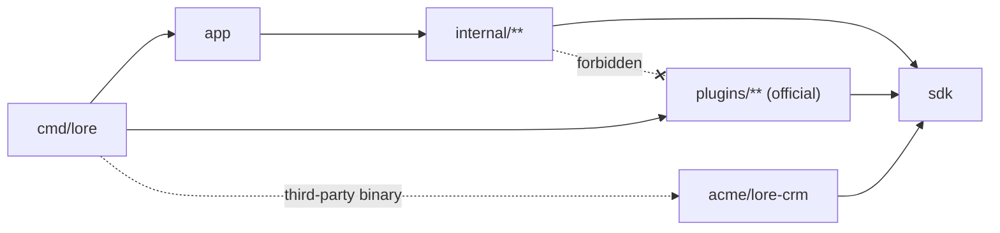

# 08 — Extensibility (plugins)

Connectors and model providers are **plugins**, not built-ins. The engine
holds no name of any source or provider: it holds a registry, a manifest
contract, and a configuration format. The connectors and providers Lore ships
are *official plugins* — same contract, same directory rules, same
certification suite as anything a third party writes.

This document defines the contract, the registry, the configuration, and the
boundaries that keep them honest. The wire protocol for out-of-process plugins
is [09](09-plugin-protocol.md); how a plugin binary is named, fetched and
trusted is [10](10-plugin-distribution.md).

## What is a plugin, and what is not

A component becomes a plugin only when all three hold:

1. **Data-shaped contract** — it exchanges values, never engine internals.
2. **Plausible third-party implementations** — someone other than us would
   write one.
3. **No upward reach** — it never needs a service, the store, or another
   plugin.

Measured against that test:

| Component | Verdict | Reason |
|---|---|---|
| Sources (GitHub, GitLab, Notion, Jira, …) | **Plugin** — `KindSource` | Passes all three; the `Connector` contract was already data-in/data-out |
| Model providers (embedding, completion) | **Plugin** — `KindProvider` | Passes all three; the OpenAI-compatible driver already proved one package can serve many vendors |
| Code access (blame, log) | **Plugin** — `KindCode` | Two-method contract over a local clone; Mercurial, Jujutsu and remote forges are real alternative implementations |
| Secret resolution | **Deferred** — `KindSecrets` | Passes the test (1Password, Vault, keychain) but has no second implementation yet. The seam is already forced: plugins never read the environment, the host injects |
| Chunking strategy | **Not a plugin** | Fails (3) softly — chunking decides index quality and interacts with ranking. A per-source hint on `KindSource` is the cheaper answer if it is ever needed |
| IndexStore (SQLite) | **Not a plugin** | Passes (1) and (3), fails (2): one implementation, and an alternative must also reproduce lease semantics and the fixed vector width. Revisit only with a second real candidate |
| Query engine, graph walk, ranking, RRF, LinkResolver | **Never a plugin** | Fails (3) hard — this *is* the engine, and it is the differentiator. Extensibility here freezes everything and buys nothing |
| Transports (MCP, gRPC, CLI) | **Never a plugin** | Fails (3): a transport calls services, which inverts the layering rule in [02](02-architecture.md). Adding one is already a package plus an FX entry |
| Scheduler, sync lease, orchestration | **Never a plugin** | Fails (1): it owns crash-safety invariants |
| `sdk/httpx`, `sdk/refs` | Neither | Shared libraries plugins *use*, not extension points |

The surface stays small on purpose: it is the part that cannot be changed
later without breaking other people's code.

## Layout

```
cmd/lore/             # composition root — the ONLY place that names plugins
app/                  # package app — composable wiring; takes []lore.Plugin
sdk/                  # package lore — the public contract. stdlib only.
├── document.go       #   Document, DocID, DocType, RawRef, RefKind, Batch, Cursor
├── connector.go      #   Connector
├── provider.go       #   Embedder, Completer
├── code.go           #   CodeRepo, BlameSpan, CommitRef
├── plugin.go         #   Plugin, Source/Provider/CodePlugin, Manifest, Field, Secret
├── host.go           #   Host, SourceConfig, ProviderConfig, CodeConfig
├── httpx/            #   retrying HTTP client (Retry-After aware)
├── refs/             #   reference scanning helpers (URLs, ticket keys, SHAs, paths)
└── conform/          #   connector conformance suite = plugin certification suite
plugins/              # OFFICIAL PLUGINS — no privileges a third party lacks
├── plugins.go        #   package plugins — Official() []lore.Plugin
├── sources/{github,gitlab,notion,jira}/
├── providers/{openai,anthropic,ollama,compat}/
└── code/git/
internal/             # the engine — knows no source or provider name
├── registry/         #   register, validate manifests, build instances
├── plugexec/         #   external-plugin host (see 09)
├── config/ di/ entities/ errors/ repositories/ services/ transport/ mocks/
test/e2e/             # composes the real binary, so it lives outside internal/
```

Dependency direction, enforced rather than documented:



| Rule | Enforced by |
|---|---|
| `sdk/**` imports the standard library only — not even a YAML package | depguard |
| `plugins/**` imports `sdk/**` and the standard library only | depguard |
| `internal/**` never imports `plugins/**` | depguard |
| A manifest's declared capabilities match the built value's interfaces | registry, at registration; a lie fails `make test` |

`sdk` being stdlib-only is why plugin configuration is delivered as JSON bytes
rather than a YAML node: YAML stays a host concern, and the same bytes work
unchanged over a pipe for an out-of-process plugin.

## The contract

```go
package lore // github.com/setthasit/Lore/sdk

const APIVersion = 1

// ---- data contract -------------------------------------------------------

type DocID string
type DocType string   // open set: a plugin may introduce a type
type RefKind string   // closed vocabulary: an unknown kind is rejected at ingest

type RawRef   struct { Kind RefKind; Value string }
type Document struct { ID DocID; Source string; Type DocType; RepoRef, Title,
                       Body, Author, URL string; CreatedAt, UpdatedAt time.Time
                       Refs []RawRef }
type Cursor   map[string]string
type Batch    struct { Docs []Document; Cursor Cursor }

// ---- capabilities a plugin implements ------------------------------------

type Connector interface {
    Name() string
    Changes(ctx context.Context, cursor Cursor) iter.Seq2[Batch, error]
}

type Embedder interface {
    Embed(ctx context.Context, texts []string) ([][]float32, error)
    Dimensions() int
}

type Completer interface {
    Complete(ctx context.Context, system, user string) (string, error)
}

type CodeRepo interface {
    Blame(ctx context.Context, path string, startLine, endLine int) ([]BlameSpan, error)
    Log(ctx context.Context, path string) ([]CommitRef, error)
}

// Provider is deliberately unconstrained: capabilities are optional interfaces,
// asserted by the host against the manifest and rejected on mismatch.
type Provider = any

// ---- how a plugin declares itself ----------------------------------------

type Kind string

const (
    KindSource   Kind = "source"
    KindProvider Kind = "provider"
    KindCode     Kind = "code"
)

type Plugin interface{ Manifest() Manifest }

type SourcePlugin   interface { Plugin; NewSource(SourceConfig) (Connector, error) }
type ProviderPlugin interface { Plugin; NewProvider(ProviderConfig) (Provider, error) }
type CodePlugin     interface { Plugin; NewCode(CodeConfig) (CodeRepo, error) }
```

`Embedder` reports `Dimensions()` and **not** an identity string. The host
composes the vector-space identity as `<plugin>/<model>/<dims>` from the
manifest name, the configured model and the reported width, so a plugin cannot
claim another provider's identity and silently poison an index. Identity
mismatch handling — the `lore sync --reembed` path — is unchanged
([04](04-connectors-and-sync.md#sync)).

### Manifest

```go
type Manifest struct {
    Name         string       // "github", "openai-compatible", "git"
    Kind         Kind
    APIVersion   int          // must equal lore.APIVersion
    Summary      string       // one line; shown by `lore plugin list`
    Capabilities Capabilities
    Fields       []Field      // the plugin's `with:` block
    Secrets      []Secret
}

type Capabilities struct {
    Embed       bool // provider serves embeddings
    Complete    bool // provider serves completions
    RepoRemotes bool // source documents carry repo paths a local clone maps onto
}

type Field struct {
    Name     string    // "base_url"
    Type     FieldType // string | url | int | bool | string_list | duration
    Required bool
    Default  string
    Doc      string    // shown in `lore init` scaffolds and errors
    Prompt   string    // question `lore source add` asks
}

type Secret struct {
    Key         string // "token" — how the plugin asks for it
    ConfigField string // "token_env" — the config key naming the env var
    DefaultEnv  string // "LORE_GITHUB_TOKEN"
    Doc         string
}
```

The manifest is not documentation: it *generates* the `lore init` scaffold, the
`lore source add` prompts, the configuration validation, and the error text.
There is exactly one description of a plugin's configuration, and it lives with
the plugin.

`Capabilities.RepoRemotes` replaces the hardcoded forge check behind the
startup warning that a registered local clone has no matching ingest source: a
third-party forge plugin keeps that warning working by declaring the capability
and implementing `MatchesRemote(string) bool`.

### Construction

```go
type Host struct {
    HTTP *http.Client   // retrying, Retry-After aware
    Log  *slog.Logger
    Now  func() time.Time
}

type SourceConfig struct {
    Instance string          // "jira-acme" — cursor key, Source value, DocID prefix
    Config   json.RawMessage // the `with:` block
    Secrets  map[string]string
    Host     Host
}

func (c SourceConfig) Decode(v any) error                    // strict: unknown fields rejected
func (c SourceConfig) Secret(key string) string              // declared secrets only
func (c SourceConfig) DocID(t DocType, external string) DocID
```

A plugin **never** reads the environment. The host resolves the env var named
by each secret's `ConfigField` and injects the value. That single discipline is
what makes a per-plugin secret allowlist possible for out-of-process plugins,
and it is what keeps one plugin from reading another's token.

An official plugin in full:

```go
// plugins/sources/jira/plugin.go
func Plugin() lore.SourcePlugin { return plugin{} }

func (plugin) Manifest() lore.Manifest {
    return lore.Manifest{
        Name: "jira", Kind: lore.KindSource, APIVersion: lore.APIVersion,
        Summary: "Jira Cloud issues and comments (read-only)",
        Fields: []lore.Field{
            {Name: "base_url", Type: lore.FieldURL, Required: true,
             Prompt: "Jira site URL", Doc: "https://<org>.atlassian.net"},
            {Name: "projects", Type: lore.FieldStringList, Required: true,
             Prompt: "Project keys to ingest"},
        },
        Secrets: []lore.Secret{
            {Key: "email", ConfigField: "email_env", DefaultEnv: "LORE_JIRA_EMAIL"},
            {Key: "token", ConfigField: "token_env", DefaultEnv: "LORE_JIRA_TOKEN"},
        },
    }
}

func (plugin) NewSource(c lore.SourceConfig) (lore.Connector, error) {
    var cfg struct {
        BaseURL  string   `json:"base_url"`
        Projects []string `json:"projects"`
    }
    if err := c.Decode(&cfg); err != nil {
        return nil, err
    }
    return newConnector(c, cfg.BaseURL, cfg.Projects), nil
}
```

## Registry and composition root

The registry is host-side and holds no list of its own. Registration validates
name uniqueness, `APIVersion`, kind-versus-interface, and manifest-versus-built
capabilities; a plugin that misdeclares itself fails at registration, not
during a user's sync.

`cmd/lore/main.go` is the only file that names plugins:

```go
func main() { app.Run(app.With(plugins.Official()...)) }
```

A third-party distribution is the same file with one more argument:

```go
app.Run(app.With(append(plugins.Official(), acmecrm.Plugin(), myjira.Plugin())...))
```

Compiled plugins and external plugins ([09](09-plugin-protocol.md)) both end up
as `lore.Connector` / `lore.Provider` / `lore.CodeRepo` values in the registry.
The services layer never learns which mode a plugin came from.

## Instances

A plugin is a type; configuration creates **instances** of it.

- `id` defaults to `use`, so a single-instance workspace reads `use: github`
  and gets the instance id `github`.
- Two instances of one plugin (two Jira sites, two GitHub orgs) require
  distinct ids.
- The instance id is the sync cursor key, the value of `Document.Source`, and
  the `DocID` prefix — hence `SourceConfig.DocID`, so a connector cannot
  hardcode its own name into identity.
- `--source` / `sync_now(source:)` accept instance ids. The valid set is built
  from the live registry, exactly as it is built from live connectors today.
- The orchestrator asserts `doc.Source == instance` and that `doc.ID` carries
  the instance prefix, and fails the batch otherwise. Nothing in the schema
  constrains the source column, so a mislabelling plugin would otherwise write
  into another instance's namespace silently.

## Configuration

```yaml
workspace: myproject
index_path: ~/.lore/myproject.db

plugins:                                    # OPTIONAL — external plugins; see 10
  - name: linear
    from: github.com/jdoe/lore-linear@v0.3.1

sources:                                    # instances, in sync order
  - use: github                             # id defaults to "github"
    with:
      token_env: LORE_GITHUB_TOKEN
      repos: [acme/app]
  - id: jira-acme
    use: jira
    with: { base_url: https://acme.atlassian.net, projects: [PROJ] }
  - id: jira-legacy
    use: jira
    with: { base_url: https://legacy.atlassian.net, projects: [OLD] }
  - id: linear
    use: linear                             # external plugin, identical syntax
    with: { team: PLATFORM, token_env: LORE_LINEAR_TOKEN }

providers:                                  # OPTIONAL — an undeclared provider id
  - id: openrouter                          # that names a registered plugin is
    use: openai-compatible                  # built with that plugin's defaults
    with:
      base_url: https://openrouter.ai/api
      api_key_env: LORE_OPENROUTER_KEY

embedder: { provider: openai,     model: text-embedding-3-small }
llm:      { provider: openrouter, model: moonshotai/kimi-k2 }

repos:                                      # OPTIONAL — local clones
  - path: ~/dev/app
    use: git                                # KindCode plugin; default "git"
    remote: github:acme/app
```

Loading is two-stage. The core skeleton decodes strictly. Each `with:` block is
captured raw, re-encoded as JSON, checked against the plugin's `Fields` and
`Secrets`, and handed to the plugin, which decodes it strictly itself. The
generic check produces messages of the same quality the hand-written validators
produced:

```
sources[jira-acme].with.token_env names LORE_JIRA_TOKEN, but that environment
variable is not set
```

Resolution order for every `use:` is compiled registry, then `plugins:`
declarations, then failure — and the failure names what this build actually
has:

```
sources[crm].use names "acme-crm", which is neither a compiled plugin
(github, gitlab, jira, notion) nor declared in plugins:. Either add it to
plugins: as an external binary, or build a lore binary that registers it.
Run `lore plugin list` to see what this build has.
```

## Provider roles and drivers

`embedder:` and `llm:` are **role bindings**: they name a provider instance and
a model. Adding a role later (a reranker, a summarizer) adds a key, not
plumbing.

| Role | Interface the bound provider must implement | Required |
|---|---|---|
| `embedder` | `lore.Embedder` | yes — indexing and query embedding |
| `llm` | `lore.Completer` | no — synthesis is optional; MCP never needs it |

Binding a role to a provider that lacks the capability is a configuration
error at load, naming what the provider can do instead.

Most vendors speak the OpenAI chat-completions protocol, so they are **presets
of one driver**, not packages:

| Provider | How it ships |
|---|---|
| OpenAI | native driver — `plugins/providers/openai` |
| Anthropic | native driver — different wire format |
| Ollama | native driver — local daemon, embeddings and completions |
| Z.AI, OpenRouter, Moonshot (Kimi), DeepSeek, Groq, Together, vLLM, LM Studio | preset rows in `plugins/providers/compat` |

A preset is a base URL and a default model list. Reaching a new
OpenAI-compatible vendor is a configuration change with no new code:

```yaml
providers:
  - id: kimi
    use: openai-compatible
    with: { base_url: https://api.moonshot.ai, api_key_env: LORE_MOONSHOT_KEY }
```

Model-to-dimensions knowledge belongs to the driver that knows it, never to the
engine. The engine enforces one rule: the resolved embedder must report a
positive width before the index opens.

## Invariants a plugin must not break

Certification ([`sdk/conform`](09-plugin-protocol.md#conformance)) checks the
first four; the engine enforces the rest at runtime.

1. **Resumable and idempotent.** `Changes` from a mid-stream cursor yields the
   remainder, and re-running a stream re-yields identical `DocID`s. Upserts are
   idempotent by `DocID`.
2. **The batch is the checkpoint unit.** Every `Batch` carries the cursor that
   becomes durable once its documents are committed.
3. **Both timestamps.** `CreatedAt` is event time, `UpdatedAt` is edit time. A
   source without a true creation time sets them equal and says so in its
   manifest summary.
4. **Full identity.** Every document carries `ID`, `Source`, `Type`, `URL`.
5. **Read-only.** No plugin writes to its source, ever.
6. **Known `RefKind` values only.** The vocabulary is closed (`url`,
   `ticket_key`, `commit_sha`, `file_path`, `pr_number`). An unknown kind is
   rejected at ingest with the known list, because the resolver would otherwise
   drop those references silently and the plugin author would have nothing to
   debug. `DocType`, by contrast, is open: an unknown type chunks and ranks as
   ordinary evidence.
7. **No store access, no service access, no cross-plugin calls.** A plugin
   returns data; the engine decides what to do with it.

One workspace has exactly **one** embedding binding, permanently. The vector
column's width is baked into the index at creation and frozen in `meta`
([03](03-data-model.md)); mixing vector spaces in one index is not a
configuration mistake to be validated, it is not representable. Changing the
embedder means `lore sync --reembed`.

## Non-goals

- **No engine hooks.** Ranking, walking, chunking, chain assembly and gap
  reporting are not extensible. Keeping the extension surface small is what
  lets it stay stable.
- **No plugin-authored transports.** A transport calls services and would
  invert the layering rule.
- **No host callbacks in the plugin protocol.** A plugin that wants to read the
  store is misdesigned.
- **No Go `plugin` package.** Version-locked, no Windows, and it breaks the
  pure-Go build.
- **No compatibility shims.** There is no released version to be compatible
  with; the configuration format changes in place and `lore init` regenerates.
