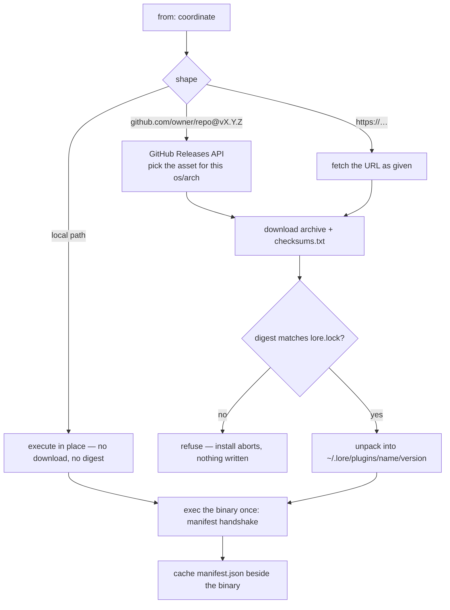

# 10 — Plugin Distribution & Trust

How an external plugin binary is named, fetched, pinned, verified and run.
The wire protocol it speaks once it is running is
[09](09-plugin-protocol.md); the contract it implements is
[08](08-extensibility.md). This document owns the supply chain only —
coordinates, resolution, the lockfile, on-disk layout, the CLI, signatures —
and states plainly what privilege an installed plugin holds.

## Two ways to get a plugin

| | Compiled plugin | External plugin |
|---|---|---|
| Declared in | the composition root, `cmd/lore/main.go` | `plugins:` in `lore.yaml` |
| Bound | at link time | at runtime — exec + NDJSON over stdio |
| Language | Go | any |
| Cost to adopt | rebuild `lore` | none |
| Call shape | in-process, compile-time type safety | subprocess, framed JSON |
| Misdeclaration surfaces | at registration, in `make test` | at the `manifest` handshake |

Go cannot dynamically load code — the `plugin` package is version-locked, has
no Windows support, and breaks the pure-Go build
([08 — Non-goals](08-extensibility.md#non-goals)) — so a compiled third-party
plugin ALWAYS means a custom binary. That is a language constraint, not a
design choice, and it is why `lore build` exists.

Exec is the default for third-party plugins because sync is I/O bound: a
subprocess boundary costs nothing measurable against network round-trips.

## Coordinates

A plugin is declared once under `plugins:` with a short `name` — the token
every `use:` refers to — and a `from` coordinate saying where the binary comes
from. Dispatch is by the shape of `from`:

| Shape of `from` | Resolves to | Digest |
|---|---|---|
| `./x`, `../x`, `/x`, `~/x` | a local file, executed in place | not required; startup warns that the plugin is unpinned and for development only |
| `github.com/owner/repo@vX.Y.Z` | the GitHub Releases asset published for that tag | required |
| `https://…` | that artifact URL verbatim — private or self-hosted distribution | required |

A remote coordinate MUST pin an exact version in `lore.yaml`. `@latest` is
accepted only as an argument to `lore plugin install`, which resolves it and
writes the concrete version back into the file, because a floating version
means two machines silently run different code against the same index.

```yaml
plugins:
  - name: linear
    from: github.com/jdoe/lore-linear@v0.3.1
  - name: acme-crm
    from: https://artifacts.acme.internal/lore/acme-crm/v2.0.1.tar.gz
  - name: scratch
    from: ./bin/lore-scratch            # dev only — unpinned, warns at startup

sources:
  - id: linear
    use: linear                         # the short name declared above
    with: { team: PLATFORM, token_env: LORE_LINEAR_TOKEN }
  - id: crm
    use: acme-crm
    with: { base_url: https://crm.acme.internal, token_env: LORE_CRM_TOKEN }
```

An external plugin's `sources:` entry is syntactically identical to a compiled
one's ([08](08-extensibility.md#configuration)); `with:` names environment
variables only, and the host resolves them and injects the values — a plugin
never reads the environment.

## Resolution and install



Plugin authors MUST publish under the goreleaser default naming, because the
resolver constructs the expected asset name rather than guessing among a
release's attachments:

| Artifact | Name |
|---|---|
| Archive | `<repo>_<version>_<os>_<arch>.tar.gz` — e.g. `lore-linear_0.3.1_darwin_arm64.tar.gz` |
| Checksums | `checksums.txt`, one `<sha256>  <filename>` line per archive |

`<version>` is the tag without its leading `v`; `<os>`/`<arch>` are `GOOS`/
`GOARCH` spellings. A release that does not follow the convention fails to
resolve with the exact name that was looked for.

The manifest is ALWAYS read from the binary through the `manifest` handshake,
never from a file inside the archive, so a plugin cannot ship a manifest that
disagrees with its behavior. The cached `manifest.json` is a cache: deleting it
costs one exec, and a stale copy can never outvote the binary.

## lore.lock

A separate file beside `lore.yaml`, committed to the repository. It records,
per plugin, the resolved version, the artifact URL, and a digest **per
os/arch** — a team on macOS with Linux CI needs both, which is why the digest
is not an inline field in `lore.yaml`.

```yaml
# lore.lock — generated; written by `lore plugin install|update`
version: 1
plugins:
  linear:
    version: v0.3.1
    from: github.com/jdoe/lore-linear@v0.3.1
    artifacts:
      darwin/arm64:
        url: https://github.com/jdoe/lore-linear/releases/download/v0.3.1/lore-linear_0.3.1_darwin_arm64.tar.gz
        digest: sha256:9f2b41c0…d7e5
      linux/amd64:
        url: https://github.com/jdoe/lore-linear/releases/download/v0.3.1/lore-linear_0.3.1_linux_amd64.tar.gz
        digest: sha256:1a08be77…33c9
  acme-crm:
    version: v2.0.1
    from: https://artifacts.acme.internal/lore/acme-crm/v2.0.1.tar.gz
    artifacts:
      darwin/arm64:
        url: https://artifacts.acme.internal/lore/acme-crm/v2.0.1.tar.gz
        digest: sha256:5c7d90ab…8f11
```

Rules:

- A digest mismatch REFUSES to launch the plugin. It never warns and
  continues, and no flag makes it continue.
- `lore plugin update` is the only command that rewrites a locked digest.
  `install` writes entries that do not exist yet; it never replaces one.
- A locally-sourced plugin has no lock entry, by construction. That is the
  entire cost of the development escape hatch, and the startup warning says so.
- A declared plugin with no lock entry for the running os/arch is a startup
  error, not a silent download.

## On-disk layout

```
~/.lore/plugins/
└── linear/
    ├── v0.3.0/
    │   ├── lore-linear
    │   ├── manifest.json
    │   └── .digest
    └── v0.3.1/
        ├── lore-linear
        ├── manifest.json
        └── .digest
```

Versions are separated by directory, so several may coexist on one machine —
different workspaces pin differently. The workspace's `lore.lock` decides which
one runs; the cache never picks. `.digest` holds the verified digest of the
unpacked binary and is re-checked at launch, so tampering with a cached binary
after installation is caught too.

## No network at sync time

Installation is explicit and never implicit. Auto-install defaults to off
because a background scheduler MUST NOT download and execute code on a timer;
nothing inside a sync round ever fetches a plugin.

A declared-but-uninstalled plugin fails at startup — before the scheduler
starts, before any source is touched — with the exact command to run:

```
plugins[linear] is not installed — run: lore plugin install linear
```

## CLI

Same shape as the rest of the surface ([06](06-interfaces-and-config.md#cli)):

| Command | Semantics |
|---|---|
| `lore plugin list` | every plugin this build can use: name, kind, version, and origin — `builtin` or `external <path>` |
| `lore plugin install [<name> \| <coordinate>[@latest]]` | resolve, download, verify, unpack, handshake, write `lore.lock`; no argument installs everything declared |
| `lore plugin update <name>[@<version>]` | re-resolve and rewrite the locked version, URLs and digests |
| `lore plugin remove <name>` | drop the declaration, the lock entry and the cached versions |
| `lore plugin verify <name>` | re-check the digest and run `sdk/conform` against the installed binary |
| `lore plugin search <query>` | query the plugin index — a JSON file in a git repository |

`verify` runs the same certification suite the official plugins run
([09](09-plugin-protocol.md#conformance)); it needs only a `lore.Connector`, so
it neither knows nor cares that the implementation is a subprocess. `search` is
deliberately the last piece built: there is nothing to search until an
ecosystem exists, and an index shipped before then is an empty file that still
has to be maintained.

Custom binaries, modelled on xcaddy:

```
lore build --with github.com/jdoe/lore-linear@v0.3.1 [--with …] [-o lore]
```

It generates a composition root that imports the named modules and passes them
to `app.With`, runs `go build`, and emits a binary with those plugins compiled
in. It requires a Go toolchain on the machine; that is the whole trade for
in-process calls and compile-time type safety.

## Signatures

A declaration may carry a `pubkey:`, which enables cosign/minisign
verification of `checksums.txt` before any digest is compared:

```yaml
plugins:
  - name: linear
    from: github.com/jdoe/lore-linear@v0.3.1
    pubkey: ./keys/jdoe-lore.pub
```

The two layers defend different things and neither substitutes for the other:

| Layer | Defends against | Status |
|---|---|---|
| Lockfile digest | tampering after publication — a mutated release asset, a hostile mirror, a rewritten cached binary | mandatory for every remote coordinate |
| Signature | a compromised publisher account cutting a new release with internally valid checksums | opt-in, per plugin |

## Trust model

An external plugin runs as a subprocess with the user's privileges and holds
its source's token. Invariant 5 — read-only, no plugin writes to its source
([08](08-extensibility.md#invariants-a-plugin-must-not-break)) — is a promise
by the author, not something the engine enforces. Installing a plugin is
running that author's code on your machine, and the CLI says so at install
time.

The mitigations that exist in the design:

- **Per-plugin secret injection.** A plugin receives only the secrets its
  manifest declared, resolved and injected by the host; it never sees the
  ambient environment, so a Linear plugin cannot read `LORE_GITHUB_TOKEN`.
- **Mandatory digest pinning.** Remote code is pinned by content, not by tag.
- **Explicit installation.** No implicit download, no auto-install by default,
  no fetch inside a sync round.
- **`lore plugin verify`.** Conformance evidence on demand, against the exact
  binary that will run.
- **WASM via wazero** — already in the dependency tree as SQLite's runtime
  ([02 — D6](02-architecture.md#key-design-decisions)) — is the only tier that
  could *enforce* a sandbox rather than request one, and is the intended answer
  for untrusted authors. The honest caveat: a connector needs the network, so a
  WASM plugin needs an HTTP host function with a domain allowlist, and that
  allowlist becomes the real security boundary.

Least-privilege tokens remain the load-bearing control. The guidance in
[06 — Security posture](06-interfaces-and-config.md#security-posture) extends
unchanged to plugins: scope the credential to the projects, teams or spaces the
plugin must read, prefer read-only tokens, and never issue a plugin a token
broader than the `with:` block it was given.

## Failure modes

| Condition | What the user sees | What the engine does |
|---|---|---|
| Digest mismatch | `plugins[linear]: digest mismatch for darwin/arm64 (expected sha256:9f2b…, got sha256:c410…)` | refuses to launch the plugin; startup fails; never downgrades to a warning |
| Missing binary | `plugins[linear] is not installed — run: lore plugin install linear` | startup fails before the scheduler starts; nothing is fetched |
| Manifest `api_version` mismatch | `plugin "linear" speaks api_version 2, host speaks 1` | rejected at the handshake, both numbers named; startup fails rather than run a source over a contract neither side agrees on |
| Plugin crashes mid-stream | the instance, the last op, and the process exit status | reports a plugin crash and fails that source's round; the last persisted cursor is authoritative ([09](09-plugin-protocol.md)), so unflushed frames are only work the next round redoes; other sources finish theirs |
| Line exceeds the 8 MiB cap | the instance and the op whose frame was oversized | fails the operation; the plugin must split oversized batches into several frames, since the batch is the checkpoint unit |
| Unresolvable coordinate | the coordinate and the step that failed — unknown tag, 404, DNS | install aborts; `lore.lock` is not written |
| No release asset for this os/arch | the asset name that was looked for and the assets the release actually has | install aborts for that platform; lock entries for other platforms stay intact |

None of these corrupts the index: writes are idempotent by `DocID` and a cursor
advances only after its batch is durably committed
([04](04-connectors-and-sync.md#sync-round)).
