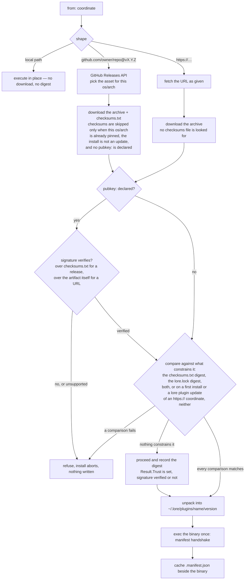

# 10 — Plugin Distribution & Trust

How an external plugin binary is named, fetched, pinned, verified and run.
The wire protocol it speaks once it is running is
[09](09-plugin-protocol.md); the contract it implements is
[08](08-extensibility.md). This document owns the supply chain only —
coordinates, resolution, the lockfile, on-disk layout, the CLI, signatures —
and states plainly what privilege an installed plugin holds.

## Three ways to get a plugin

| | Official compiled plugin | Third-party plugin compiled in | External plugin |
|---|---|---|---|
| Declared in | the composition root, `cmd/lore/main.go` | `--with` on one `lore build` run, which generates its own root (`Render`, `internal/plugbuild/generate.go`) | `plugins:` in `lore.yaml` |
| Bound | at link time | at link time | at runtime, exec + NDJSON over stdio |
| Language | Go | Go | any |
| Registered through | `Register`, so origin `builtin` | `Register`, so origin `builtin` (`app.Run`, `app/app.go`) | `RegisterExternal`, so origin `external <path>` |
| Cost to adopt | none, it ships in the binary | a Go toolchain and one rebuild | none |
| Call shape | in-process, compile-time type safety | in-process, compile-time type safety | subprocess, framed JSON |
| Misdeclaration surfaces | at registration, in `make test` | at registration, when `lore build` runs the binary it just wrote (`readBackPlugins`, `internal/plugbuild/plugbuild.go`) | at the `manifest` handshake |

Go cannot dynamically load code — the `plugin` package is version-locked, has
no Windows support, and breaks the pure-Go build
([08 — Non-goals](08-extensibility.md#non-goals)) — so a compiled third-party
plugin ALWAYS means a custom binary. That is a language constraint, not a
design choice, and it is why `lore build` exists.

Exec is the default for third-party plugins because sync is I/O bound: a
subprocess boundary costs nothing measurable against network round-trips.

## Coordinates

A plugin is declared once under `plugins:` with a short `name` — the token
every `use:` refers to — and a `from` coordinate saying where the binary comes
from. Dispatch is by the shape of `from`:

| Shape of `from` | Resolves to | What a digest constrains |
|---|---|---|
| `./x`, `../x`, `/x`, `~/x` | a local file, executed in place | nothing: no download, no digest and no `lore.lock` entry, and startup warns that the plugin is unpinned and for development only (`Coordinate.Warning`, `internal/plugindist/coordinate.go`) |
| `github.com/owner/repo@vX.Y.Z` | the GitHub Releases asset published for that tag | the release's own `checksums.txt` on the first install, the `lore.lock` digest on every later install that is not a `lore plugin update` |
| `https://…` | that artifact URL verbatim, for private or self-hosted distribution | nothing on the first install, and from then on the `lore.lock` digest it recorded, which a `lore plugin update` replaces rather than checks |

What each shape verifies, and what a `pubkey:` adds to it, is
[What each install shape verifies](#what-each-install-shape-verifies).

A `github.com/…` coordinate MUST pin an exact release tag, checked by
`ExactVersion` (`internal/plugindist/coordinate.go`), because a floating
version means two machines silently run different code against the same index.
`@latest` on such a coordinate is accepted wherever `parseCoordinate` is
reached through `ResolveInstall`, which is every `lore plugin install` that
names its target and every `lore plugin update`, and what they resolve is
written back into `lore.yaml`. Every other read of the declaration goes through
`Resolve`, which refuses `@latest` left in the file: startup
(`internal/di/external.go`, `newExternals`), an argument-free
`lore plugin install` (`Workspace.requests`), `lore plugin list`
(`Workspace.Installed`), `lore plugin verify` (`Workspace.Verify`) and every
manifest read (`Workspace.Manifest`), which is how `lore source add` finds an
installed plugin and how `lore plugin install` prints the manifest of what it
installed. An `https://` coordinate carries its version in the URL's last path
segment, which `parseURL` requires to be present and readable as one cache
directory name and cannot check for exactness.

```yaml
plugins:
  - name: linear
    from: github.com/jdoe/lore-linear@v0.3.1
  - name: acme-crm
    from: https://artifacts.acme.internal/lore/acme-crm/v2.0.1.tar.gz
  - name: scratch
    from: ./bin/lore-scratch            # dev only — unpinned, warns at startup

sources:
  - id: linear
    use: linear                         # the short name declared above
    with: { team: PLATFORM, token_env: LORE_LINEAR_TOKEN }
  - id: crm
    use: acme-crm
    with: { base_url: https://crm.acme.internal, token_env: LORE_CRM_TOKEN }
```

An external plugin's `sources:` entry is syntactically identical to a compiled
one's ([08](08-extensibility.md#configuration)). The `with:` keys the plugin's
manifest declares as secrets name environment variables, and the host resolves
each of those names (`resolveSecrets`, `internal/registry/secrets.go`) and
sends the value as `Secrets` in the request payload (`connector.Changes`,
`internal/plugexec/connector.go`). Every other `with:` key travels as `Config`,
which `configJSON` (`internal/registry/with.go`) builds from the fields the
manifest declares, and what the subprocess environment does hold is in
[the trust model](#trust-model).

## Resolution and install


```mermaid
flowchart TB
    C["from: coordinate"] --> K{shape}
    K -->|"local path"| L["execute in place — no download, no digest"]
    K -->|"github.com/owner/repo@vX.Y.Z"| G["GitHub Releases API<br/>pick the asset for this os/arch"]
    K -->|"https://…"| U["fetch the URL as given"]
    G --> GC["download the archive + checksums.txt<br/>checksums are skipped only when this os/arch<br/>is already pinned, the install is not an update,<br/>and no pubkey: is declared"]
    U --> UA["download the archive<br/>no checksums file is looked for"]
    GC --> S
    UA --> S{"pubkey: declared?"}
    S -->|"yes"| SV{"signature verifies?<br/>over checksums.txt for a release,<br/>over the artifact itself for a URL"}
    S -->|"no"| V
    SV -->|"no, or unsupported"| X
    SV -->|"verified"| V{"compare against what constrains it:<br/>the checksums.txt digest, the lore.lock digest,<br/>both, or on a first install or a lore plugin update<br/>of an https:// coordinate, neither"}
    V -->|"a comparison fails"| X["refuse, install aborts, nothing written"]
    V -->|"nothing constrains it"| T["proceed and record the digest<br/>Result.Trust is set, signature verified or not"]
    V -->|"every comparison matches"| P["unpack into ~/.lore/plugins/name/version"]
    T --> P
    P --> M["exec the binary once: manifest handshake"]
    M --> J["cache .manifest.json beside the binary"]
```

Plugin authors MUST publish under the goreleaser default naming, because the
resolver constructs the expected asset name rather than guessing among a
release's attachments:

| Artifact | Name |
|---|---|
| Archive | `<repo>_<version>_<os>_<arch>.tar.gz` — e.g. `lore-linear_0.3.1_darwin_arm64.tar.gz` |
| Checksums | `checksums.txt`, one `<sha256>  <filename>` line per archive |

`<version>` is the tag without its leading `v`; `<os>`/`<arch>` are `GOOS`/
`GOARCH` spellings. A release that does not follow the convention fails to
resolve with the exact name that was looked for.

The manifest is ALWAYS read from the binary through the `manifest` handshake,
never from a file inside the archive, so a plugin cannot ship a manifest that
disagrees with its behavior. The cached `.manifest.json` is a cache: deleting it
costs one exec, and a stale copy can never outvote the binary.

## lore.lock

A separate file beside `lore.yaml`, committed to the repository. It records,
per plugin, the resolved version, the artifact URL, and a digest **per
os/arch** — a team on macOS with Linux CI needs both, which is why the digest
is not an inline field in `lore.yaml`.

```yaml
# lore.lock — generated; written by `lore plugin install|update`
version: 1
plugins:
  linear:
    version: v0.3.1
    from: github.com/jdoe/lore-linear@v0.3.1
    artifacts:
      darwin/arm64:
        url: https://github.com/jdoe/lore-linear/releases/download/v0.3.1/lore-linear_0.3.1_darwin_arm64.tar.gz
        digest: sha256:9f2b41c0…d7e5
      linux/amd64:
        url: https://github.com/jdoe/lore-linear/releases/download/v0.3.1/lore-linear_0.3.1_linux_amd64.tar.gz
        digest: sha256:1a08be77…33c9
  acme-crm:
    version: v2.0.1
    from: https://artifacts.acme.internal/lore/acme-crm/v2.0.1.tar.gz
    artifacts:
      darwin/arm64:
        url: https://artifacts.acme.internal/lore/acme-crm/v2.0.1.tar.gz
        digest: sha256:5c7d90ab…8f11
```

Rules:

- A digest mismatch REFUSES to launch the plugin. It never warns and
  continues, and no flag makes it continue.
- `lore plugin update` is the only command that rewrites a locked digest.
  `install` writes entries that do not exist yet; it never replaces one.
- A locally-sourced plugin has no lock entry, by construction. That is the
  entire cost of the development escape hatch, and the startup warning says so.
- A declared plugin with no lock entry for the running os/arch is a startup
  error, not a silent download.

## On-disk layout

An install of a remote coordinate leaves one directory per version, holding the
binary and the two files the host writes beside it:

```
~/.lore/plugins/
└── linear/
    ├── v0.3.0/
    │   ├── lore-linear
    │   ├── .manifest.json
    │   └── .install.json
    └── v0.3.1/
        ├── lore-linear
        ├── .manifest.json
        └── .install.json
```

The binary is written executable, under the name the record's `binary` field
holds. `.manifest.json` is the manifest the handshake answered with, re-encoded
as JSON, and `.install.json` is the install record. Both come from
`Store.recordInstall` (`internal/plugindist/store.go`), the record last, so a
version directory a finished install left behind always holds one. A capture
that fails takes the directory with it, because `Install`
(`internal/plugindist/install.go`) removes it before returning the refusal. A
local `from:` leaves none of this, since `Install` returns on its
`OriginLocal` branch before the download, the write and the handshake.

The record is not the lockfile. `lore.lock` is the workspace's pin, and the
record is the cache's account of one installed version, which a launch compares
against that pin. Its fields, in the order `installRecord`
(`internal/plugindist/store.go`) declares them:

| Field | What writes it |
|---|---|
| `binary` | `Store.write`, from the name `unpack` (`internal/plugindist/archive.go`) settled on: the archive member spelled the way `Coordinate.binaryName` spells it, or the archive's only executable member, or that same spelling given to an artifact that is not an archive |
| `binary_digest` | `Store.write`, over the unpacked bytes it has just written |
| `artifact_digest` | `Store.write`, from the digest `Install` took of the downloaded artifact, which is what a launch compares against the digest [`lore.lock`](#lorelock) records for this os/arch |
| `from` | `Store.write`, from `Coordinate.SafeFrom`, so an `https://` coordinate is recorded with its userinfo and its query stripped (`urlx.Redact`, `internal/urlx/urlx.go`) |
| `manifest` | `Store.recordInstall`, naming the file it has just written, and the only field set after the handshake |

A launch resolves through `Store.Locate` (`internal/plugindist/store.go`),
which for a remote coordinate refuses unless the name is usable and then, in
this order, `lore.lock` holds an artifact for the running os/arch, the locked
version is one cache directory name, `.install.json` reads back, its `binary`
is one file name, the file it names hashes to `binary_digest`, `from` agrees
with the entry's origin and `artifact_digest` with the digest recorded for this
os/arch. A rewritten cached binary is refused as

```
plugins[linear]: digest mismatch for darwin/arm64 — the cached binary hashes to sha256:1d77…, not the recorded sha256:4e90… — run: lore plugin install linear
```

and a cache holding another install of the same version as

```
plugins[linear]: digest mismatch for darwin/arm64 — the cache holds the install of github.com/jdoe/lore-linear@v0.3.1 at artifact sha256:c410…, but lore.lock pins github.com/jdoe/lore-linear@v0.3.1 at sha256:9f2b41c0…d7e5 — run: lore plugin install linear
```

A version directory that is not there is reported as not installed rather than
as unreadable provenance, and a local coordinate is stat'd and nothing more.
The origin comparison is on the redacted spelling both sides recorded, so two
URLs differing only in userinfo or query are the same origin to it.

Versions are separated by directory, so several may coexist on one machine —
different workspaces pin differently. The workspace's `lore.lock` decides which
one runs; the cache never picks.

`Locate` never reads `.manifest.json`. One function does, `storedManifest`
(`internal/plugindist/store.go`), reached only from `Workspace.Manifest`
(`internal/plugindist/workspace.go`), which serves the stored copy only when
the record names it, the name is a single file name, the path is a regular
file, it decodes, and `describesPlugin` accepts its kind, its non-empty name
and the host's `api_version`. Anything else falls through to a fresh handshake,
a local `from:` among them, because it has no record to name a file, and a
workspace opened with no handshake refuses instead of falling through. The
stored copy is never served for a binary that has changed, because
`Workspace.Manifest` goes through the same digest check first. Two commands
reach it: `lore plugin install`, to print the kind and summary of what it
installed (`runPluginInstall` through `renderInstalls` and `installedManifest`,
`internal/transport/cli/plugindist.go`), and `lore source add`, to find the
fields it prompts for when the name is not one this build compiled in
(`runSourceAdd` through `sourceToAdd` or `addableSources` into
`installedSource`, `internal/transport/cli/source.go`).

Every other reader executes the binary. Every remote install and every
`lore plugin update` captures a fresh reply through `Installer.captureManifest`
(`internal/plugindist/install.go`), which calls the handshake the CLI supplies,
`declaredManifest` (`internal/transport/cli/plugindist.go`), which is
`plugexec.Open`. `lore plugin verify` opens the installed binary itself through
`openDeclared` in that same file and certifies that process, never the stored
copy, because `Workspace.Verify` stops at `Store.Locate`. `lore plugin list`
resolves a declared external plugin through the record alone
(`declaredExternals`, `internal/transport/cli/plugin.go`), reading no stored
manifest and starting no process.

A running workspace always uses the manifest the live process reports.
`newExternals` (`internal/di/external.go`) resolves the binary through
`plugindist.Binary` and hands it to `plugexec.Open`
(`internal/plugexec/plugin.go`), which execs it for the handshake and registers
that reply as the plugin's `Manifest`. `internal/plugexec` imports no part of
`internal/plugindist`, so nothing on the run path can reach `.manifest.json` at
all. Every session after registration execs again (`handshake` and `spawn`,
`internal/plugexec/session.go`), and `external.dial` aborts one whose reply
changes the name or the kind, the two fields it compares.

`$LORE_HOME` relocates the plugin cache root: unset, it is `~/.lore`, and the
`plugins/` tree sits directly under whichever root applies.

## No network at sync time

Installation is explicit and never implicit. Only `lore plugin install` and
`lore plugin update` download a plugin binary, and nothing inside a sync round
fetches one, because a background scheduler MUST NOT download and execute code
on a timer. `lore build --with` fetches plugin modules through the Go toolchain
at build time (`internal/plugbuild/plugbuild.go`, `fetchRequirements`).

A declared-but-uninstalled plugin fails at startup — before the scheduler
starts, before any source is touched — with the exact command to run:

```
plugins[linear] is not installed — run: lore plugin install linear
```

## CLI

Same shape as the rest of the surface ([06](06-interfaces-and-config.md#cli)):

| Command | Semantics |
|---|---|
| `lore plugin list` | every plugin this build can use, in a `NAME`, `KIND`, `ORIGIN`, `SUMMARY` table — origin is `builtin` or `external <path>`. There is no version column. A declared external plugin that is not compiled in is not a row: it prints after the table as two lines, `declared from <coordinate>` and its state — the installed binary's origin, `not installed — run: lore plugin install <name>`, or why it is unresolvable |
| `lore plugin install [<name> \| <coordinate>[@latest]]` | resolve, download, verify, unpack, handshake, write `lore.lock`; no argument installs everything declared |
| `lore plugin update <name>[@<version>]` | re-resolve and rewrite the locked version, URLs and digests |
| `lore plugin remove <name>` | drop the declaration, the lock entry and the cached versions, in that order so a refused write to `lore.yaml` leaves the cache intact. It refuses while any `sources:`, `providers:` or `repos:` entry still uses the plugin, naming them (`Workspace.Remove`, `internal/plugindist/workspace.go`) |
| `lore plugin verify <name>` | re-check the digest and run `sdk/conform` against the installed binary; when a `sources:` entry uses the plugin, the suite runs with that instance's configuration and secrets, so that instance's environment variables must be exported, and it streams that live source for real — twice in full, then once from a mid-stream cursor. Interrupting the command ends the run |
| `lore plugin search <query>` | query the plugin index — a JSON file in a git repository |

`verify` runs the certification suite the official plugins run
([09](09-plugin-protocol.md#conformance)) against the installed binary, and a
plugin no `sources:` entry configures is certified on whatever its
unconfigured stream can show rather than failed for the configuration it was
never given.

`search` is deliberately the last piece built: there is nothing to search
until an ecosystem exists, and an index shipped before then is an empty file
that still has to be maintained.

Custom binaries, modelled on xcaddy:

```
lore build --with github.com/jdoe/lore-linear@v0.3.1 [--with …] [-o lore]
```

It generates a composition root that imports the named modules and passes them
to `app.Run`, runs `go build`, and emits a binary with those plugins compiled
in. It requires a Go toolchain on the machine; that is the whole trade for
in-process calls and compile-time type safety.

## Signatures

A declaration may carry a `pubkey:`, which enables cosign/minisign
verification of `checksums.txt` before any digest is compared:

```yaml
plugins:
  - name: linear
    from: github.com/jdoe/lore-linear@v0.3.1
    pubkey: ./keys/jdoe-lore.pub
```

A relative `pubkey:` resolves against the directory `lore.yaml` sits in, like a
local `from:`, so the key a workspace declares is the same key whichever
directory `lore` was started from.

Which tool signed the release is read from the key file's own shape, so a
workspace never declares it twice. Both formats are recognised because both are
verifiable with the standard library alone:

| Format, key | Public key | Signature |
|---|---|---|
| cosign, ECDSA | a PEM key on P-256 (the cosign default), P-384 or P-521; any other curve is refused when the key loads | base64 in a `<file>.sig` sibling, as `cosign sign-blob --key` produces and goreleaser publishes — over SHA-256 or the digest the curve implies; either verifies |
| cosign, Ed25519 | a PEM Ed25519 key | the same `<file>.sig` sibling, pure or Ed25519ph over SHA-512; either verifies |
| minisign | the 42-byte `Ed` key line | a `<file>.minisig` sibling, Ed25519 over the file's own bytes, as `minisign -S -l -m checksums.txt` produces. Plain `minisign -S` prehashes instead, and that signature is refused |

Minisign's prehashed `ED` variant hashes with BLAKE2b, which the standard
library does not offer, so such a signature is refused by name rather than
skipped: a signature layer that silently does nothing is worse than none,
because the user believes it is there.

The two layers defend different things and neither substitutes for the other:

| Layer | Defends against | Status |
|---|---|---|
| Lockfile digest | tampering after publication — a mutated release asset, a hostile mirror, a rewritten cached binary | written by the first install of a remote coordinate, then enforced on every install that is not a `lore plugin update` and at every launch, so an unsigned `https://` coordinate is constrained by nothing on its first install and nothing again on a `lore plugin update` |
| Signature | a compromised publisher account cutting a new release with internally valid checksums | opt-in, per plugin |

## Trust model

An external plugin runs as a subprocess with the user's privileges and holds
its source's token. Invariant 5 — read-only, no plugin writes to its source
([08](08-extensibility.md#invariants-a-plugin-must-not-break)) — is a promise
by the author, not something the engine enforces. Installing a plugin is
running that author's code on your machine, and the CLI says so at install
time.

Three mitigations exist in the code:

- **Per-instance secret scoping.** An external plugin's instance receives only
  the secrets its manifest declared, each read by `resolveSecrets`
  (`internal/registry/secrets.go`) from the environment variable the operator's
  `with:` entry names: a plugin registered through `RegisterExternal`
  (`internal/registry/registry.go`) cannot fall back to a default variable of
  its own choosing, which a plugin compiled in through `Register`, including
  one added by `lore build --with`, can. The host environment is not inherited
  either: `minimalEnv` (`internal/plugexec/env.go`) hands the subprocess an
  empty environment, and on Windows only the variables the Windows loader and
  runtime need. So an external Linear plugin whose `with:` entry names
  `LORE_LINEAR_TOKEN` receives that value and no secret the operator did not
  name.
- **Digest pinning.** Remote code is pinned by content, not by tag. The digest
  is recorded on first install and enforced on every install that is not a
  deliberate update, and on every launch: `Install`
  (`internal/plugindist/install.go`) refuses an artifact whose digest differs
  from the one `lore.lock` records, and `Store.Binary`
  (`internal/plugindist/store.go`), reached through the `plugindist.Binary`
  wrapper, re-hashes the binary on disk before the host resolves it for launch
  (`internal/di/external.go`, `newExternals`). A GitHub release coordinate is
  checked against the release's `checksums.txt` on that first install. For an
  `https://` coordinate `Installer.locate` (`internal/plugindist/install.go`)
  looks for no checksums file, so unless that coordinate declares `pubkey:` its
  first download is compared with nothing. `Install` sets `Result.Trust`
  whenever neither a published digest nor a lockfile entry constrained the
  download, signature verified or not, and the CLI prints that.
- **Signature verification.** When a remote coordinate declares `pubkey:`,
  `Installer.expected` (`internal/plugindist/install.go`) fetches the signature
  and verifies it through `verifier.verify`
  (`internal/plugindist/signature.go`) before any digest is compared. A missing
  or unsupported signature aborts the install. A `pubkey:` on a local `from:`
  is never consulted, because `Install` returns on its local branch before
  `Installer.expected` runs.

Explicit installation ([No network at sync time](#no-network-at-sync-time)) and
`lore plugin verify` keep the operator in the loop rather than confining the
process.

Least-privilege tokens remain the load-bearing control. The guidance in
[06 — Security posture](06-interfaces-and-config.md#security-posture) extends
unchanged to plugins: scope the credential to the projects, teams or spaces the
plugin must read, prefer read-only tokens, and never issue a plugin a token
broader than the `with:` block it was given.

### What each install shape verifies

A first install of an unsigned `https://` coordinate verifies nothing about the
bytes beyond the https transport they arrived over. `Installer.locate`
(`internal/plugindist/install.go`) returns an empty checksums URL for
`OriginURL`, so `Installer.expected` has nothing to compare the download
against, and there is no lockfile digest to compare it with either, because
`Install` reaches that comparison only when `hasLocked && !req.Rewrite` holds.
What the install does instead is record the digest it computed, and every later
install that is not a `lore plugin update`, and every launch, is checked
against that record, as the digest-pinning mitigation above describes. A
`lore plugin update` of that same coordinate is a second unconstrained fetch,
and the more dangerous one, because a good digest was already recorded:
`Workspace.Update` (`internal/plugindist/workspace.go`) sets `Rewrite`, which
clears `pinned`, so nothing is compared and `lock.Set`
(`internal/plugindist/lock.go`) re-pins whatever the URL served. A
release-hosted coordinate is never in that position: `Installer.locate` fetches
the release's `checksums.txt` whenever the artifact is not already pinned, a
release that publishes no such asset fails to resolve rather than installing
unchecked, and a download that does not match the digest recorded there, or a
`checksums.txt` that records no digest for the asset name, aborts the install.
First install means no `lore.lock` artifact for this os/arch, which `Install`
reads as `lock.Artifact(coord.Name, platform)`, so the first install on a
second platform is a first install again.

| How the plugin arrives | First install verifies | Every later install verifies | A declared `pubkey:` adds |
|---|---|---|---|
| a local `from:` path | nothing, and nothing is fetched or hashed: `Install` returns on its `OriginLocal` branch once `Store.Locate` (`internal/plugindist/store.go`) finds a file rather than a directory at the resolved path | the same stat, and never a digest, because a local plugin gets no `lore.lock` entry | nothing, since that branch returns before `Installer.expected` runs |
| `github.com/owner/repo@vX.Y.Z` | the archive against the release's own `checksums.txt`, whose digest is then written to `lore.lock` | the `lore.lock` digest, unless the install is a `lore plugin update`, which sets `Rewrite`, fetches `checksums.txt` again and rewrites the pin | the signature published beside `checksums.txt`, verified before any digest is compared, on a pinned install too, because `Installer.locate` fetches the checksums file whenever a signature is declared |
| `https://…` | with no `pubkey:` declared, only the https transport the bytes arrived over. An artifact named `.tar.gz` or `.tgz` must still unpack and anything else is taken to be the binary itself (`unpack`, `internal/plugindist/archive.go`), and the binary must still answer the `manifest` handshake, but neither says where the bytes came from | the digest `lore.lock` recorded, except under `lore plugin update`, which fetches no checksums file for this shape and so verifies nothing before it re-pins. An install whose URL names a different version is refused before any download and sent to `lore plugin update` | the signature over the artifact's own bytes rather than over a checksums file. On a first install `Result.Trust` is set even so, because no published digest and no lock entry constrained the download |
| `lore build --with <module>@vX.Y.Z` | whatever the Go toolchain verifies: `fetchRequirements` (`internal/plugbuild/plugbuild.go`) runs `go get <module>@<version>` in a scratch module, and Lore compares no digest of its own | nothing, because a compiled-in plugin gets no `lore.lock` entry and every build resolves the module again through the toolchain | nothing, because `pubkey:` belongs to a `plugins:` declaration and a compiled-in plugin has none |

### An enforcing sandbox is not built

Nothing in the engine confines a plugin. Every session it serves is dialled
through `spawn` (`internal/plugexec/session.go`), which is `exec.Command` on
the plugin binary, and `Open` (`internal/plugexec/plugin.go`) wraps that
binary without applying any isolation to it. There is no runtime boundary and
no host-function allowlist, so the ceiling of the controls above is a process
that holds whatever the operator holds.

Confining a plugin inside a WebAssembly runtime is an idea and not a tier of
this system.

## Failure modes

| Condition | What the user sees | What the engine does |
|---|---|---|
| Digest mismatch at install | `plugins[linear]: digest mismatch for darwin/arm64 (expected sha256:9f2b…, got sha256:c410…)` | install aborts before anything is unpacked or written; never downgrades to a warning |
| Digest mismatch at launch | `plugins[linear]: digest mismatch for darwin/arm64 — the cached binary hashes to sha256:1d77…, not the recorded sha256:4e90… — run: lore plugin install linear` | refuses to launch the plugin; startup fails; never downgrades to a warning |
| Missing binary | `plugins[linear] is not installed — run: lore plugin install linear` | startup fails before the scheduler starts; nothing is fetched |
| Manifest `api_version` mismatch | `plugin "linear" speaks api_version 2, host speaks 1` | rejected at the handshake, both numbers named; startup fails rather than run a source over a contract neither side agrees on |
| Plugin crashes mid-stream | the instance, the last op, and the process exit status | reports a plugin crash and fails that source's round; the last persisted cursor is authoritative ([09](09-plugin-protocol.md)), so unflushed frames are only work the next round redoes; other sources finish theirs |
| Line exceeds the 8 MiB cap | the instance and the op whose frame was oversized | fails the operation; the plugin must split oversized batches into several frames, since the batch is the checkpoint unit |
| Unresolvable coordinate | the coordinate and the step that failed — unknown tag, 404, DNS | install aborts; `lore.lock` is not written |
| No release asset for this os/arch | the asset name that was looked for and the assets the release actually has | install aborts for that platform; lock entries for other platforms stay intact |

None of these corrupts the index: writes are idempotent by `DocID` and a cursor
advances only after its batch is durably committed
([04](04-connectors-and-sync.md#sync-round)).
